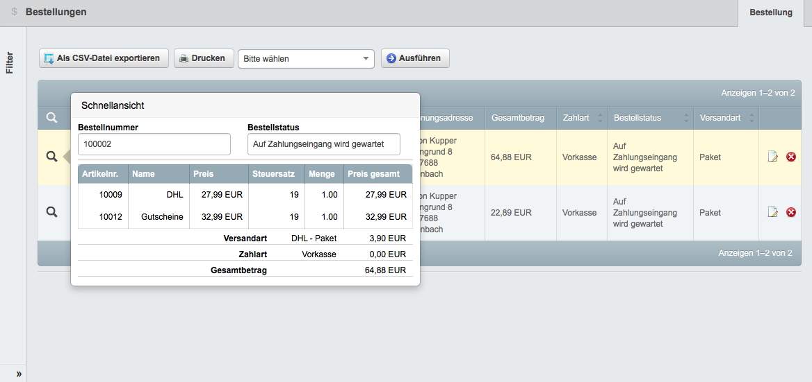
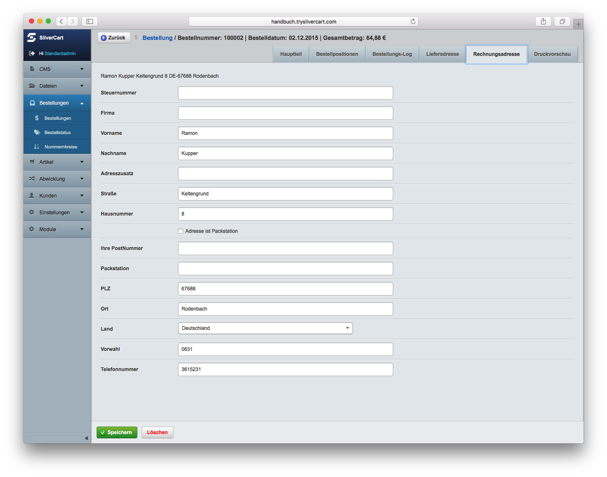
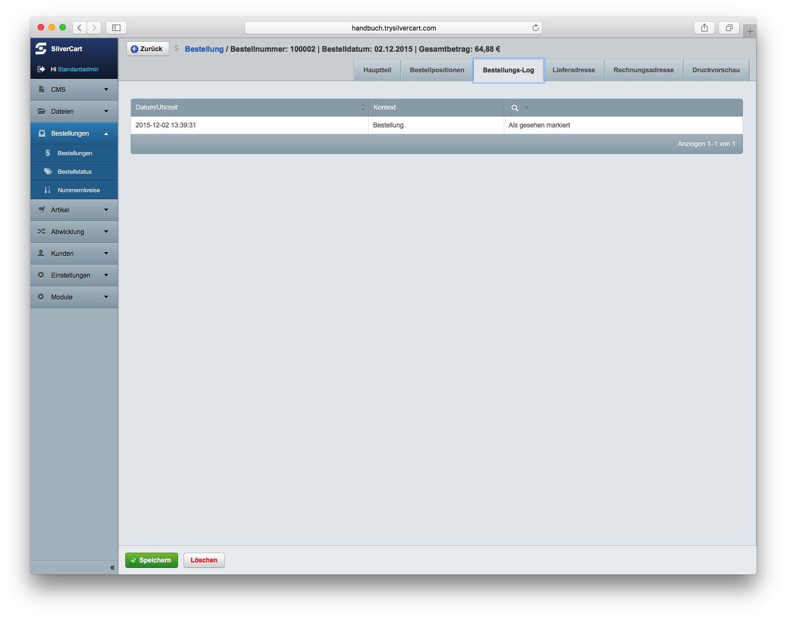

# Tab Bestellungen

Unter dem Tab Bestellungen finden Sie alle Aspekte der Bestellverwaltung, der Kontaktanfragen und der Bestellstatusverwaltung.

## Bestellungen

Hier können Sie alle eingegangenen Bestellungen einsehen. Dabei werden die neuesten Bestellungen zuerst angezeigt.

Schnellansicht

Eine sehr praktische Funktion bei der Arbeit mit Bestellungen ist die Schnellansicht.

Fahren Sie einfach mit der Maus über die Lupe in der Zeile um die Schnellansicht für diese Bestellung zu aktivieren. Es öffnet sich ein kleines Fenster mit zusätzlichen Informationen über die einzelnen Positionen der Bestellung.

Details zu einer Bestellung

Sie kommen zu den Details einer Bestellung, wenn Sie eine Bestellung aus der Suchergebnisliste anklicken. Auf dieser Seite finden Sie alle Informationen, die im Shopsystem über die Bestellung und den Kunden vorhanden sind.

Die Informationen zu abgeschlossenen Bestellungen liegen im Archiv und können nur über diese Maske geändert werden. Ändern sich nachträglich beispielsweise Produktpreise oder ändert der Kunde seine Lieferadresse, werden die Angaben zum Zeitpunkt der Bestellung dadurch nicht verändert.

Es ist derzeit noch nicht möglich, im Back-End eine neue Bestellung anzulegen. Bestehende Bestellungen können aber nachträglich bearbeitet werden.

### Bestellungen suchen

Über die Suchfunktion lassen sich Bestellungen schnell und komfortabel finden. Im Inhaltsbereich auf der linken Seite können Sie Bestellungen anhand verschiedener Suchkriterien filtern.

Sie können die gefundenen Bestellungen dann einzeln bearbeiten oder mit einer Auswahl von mehreren Bestellungen Massenänderungen durchführen.

#### Suche nach Grunddaten der Bestellung

Bestellnummer
Geben Sie hier die Bestellnummer oder den bekannten Teil der Bestellnummer ein. Dabei werden alle Bestellungen angezeigt, bei denen die angegebenen Ziffernfolge innerhalb der Bestellnummer vorkommt.
 
Bestelldatum
Zum auffinden von Bestellungen anhand des Bestelldatums, klicken Sie auf das Eingabefeld. Es öffnet sich ein Eingabefenster mit den folgenden Auswahlmöglichkeiten:

Heute - zeigt alle Bestellungen des heutigen Tage an
Letzte 7 Tage - zeigt alle Bestellungen der letzten 7 Tage an
Dieser Monat - zeigt alle Bestellungen dieses Monats an
Dieses Jahr - zeigt alle Bestellungen dieses Jahres an
Vorheriger Monat - zeigt alle Bestellungen des Vormonats an
Datum - zeigt alles Bestellungen des ausgewählten Datums an
Alles vor - zeigt alle Bestellungen vor dem ausgewählten Datum an
Alles nach - zeigt alle Bestellungen nach dem ausgewählten Datum an
Zeitraum - zeigt alle Bestellungen an, die innerhalb des ausgewählten Zeitraums eingegangen sind.

Gesehen
Sobald Sie eine Bestellung im Back-End öffnen, wird diese als „gesehen“ markiert. Über diesen Filter können Sie nach gesehenen oder ungesehenen Bestellungen suchen.

Bestellstatus
Nutzen Sie diesen Filter, wenn Sie Bestellungen anhand des Bestellstatus suchen möchten. Sie können auswählen zwischen:

* Auf Zahlungseingang wird gewartet
* Bezahlt
* In Arbeit
* Neu
* Storniert
* Versendet

Wenn Sie zusätzliche Bestellstatus definiert haben, dann erscheinen diese ebenfalls in dieser Liste.

Querverweis: Mehr über die Bestellstatus erfahren Sie im Kapitel Bestellstatus

Zahlart
Hier können Sie die Bestellungen anhand der Zahlart filtern. SilverCart bietet in der Grundinstallation Vorkasse (Prepayment) und Rechnung (Invoice) als mögliche Zahlarten an. Weitere Zahlarten sind über Erweiterungsmodule möglich. 

Versandart
Wie bei der Zahlart, sind auch die Auswahlmöglichkeiten der Versandart abhängig von den definierten Versandarten. 
Querverweis: Mehr über Versandarten erfahren Sie im Kapitel Versandart.

#### Suche nach Kundendaten

Wenn Sie Bestellungen anhand von Kundendaten suchen, dann können Sie die nachfolgenden Kriterien für Ihre Suche verwenden. Für alle Kriterien gilt:
Es werden alle Bestellungen angezeigt, bei denen der angebene Suchbegriff innerhalb des Kriteriums vorkommt. 

Die möglichen Kriterien sind:

* Kundennummer
* E-Mail
* Vorname
* Nachname
* Straße
* Hausnummer
* PLZ
* Ort
* Land

Suche nach Positionsdaten

Über die Positionsdaten finden Sie Bestellungen, die eine bestimmte  Artikelnummer mit der gewünschten Positionsmenge enthalten. Wenn Anzahl des Artikels in der Bestellung keine Rolle spielt, dann lassen Sie dieses Feld einfach leer.

Sollen nur Bestellungen angezeigt werden, die ausschliesslich diesen Artikel enthalten, markieren Sie zusätzlich das Feld Bestellung darf nur angegebene Position enthalten.

#### Sonstiges

Limit
Hier können Sie ein Anzeigelimit eintragen. Falls mehrere Bestellungen gefunden werden, werden nur so viele angezeigt wie hier angegeben wurden. Ist das Feld leer, werden alle Bestellungen angezeigt. Die Blätterfunktion (Paginierung) ist davon unabhängig.

Spalten in Suchergebnissen
Sie können die angezeigten Spalten in den Suchergebnissen selbst bestimmen. Wählen Sie hierfür einfach die gewünschten Spalten an oder ab.

Die möglichen Spalten sind:

* Bestelldatum
* Gesamtbetrag
* Bestellnummer
* Zahlart
* Lieferadresse
* Bestellstatus
* Rechnungsadresse
* Versandart

Sie haben die Möglichkeit, einzelne Spalten aus- oder einzublenden sowie alle Spalten auf einmal aus- bzw. Einzublenden.

### Bestellungen bearbeiten
Sie gelangen in die Detailansicht einer Bestellung, wenn Sie die Bestellung innerhalb der Anzeigeliste anklicken.

#### Die Tabs einer Bestellung
In der Detailansicht haben Sie Zugriff auf die folgenden Reiter:

* Hauptteil
* Bestellpositionen
* Lieferadresse
* Rechnungsadresse
* Druckvorschau
* Bestellungs-Log

##### Hauptteil

In der Detailansicht einer Bestellung wird zuerst der Hauptteil der Bestellung angezeigt.

Der Hauptteil zeigt Ihnen die wesentlichen Informationen der Zahlart, des Bestellstatus, Gesamtbetrag und das Gesamtgewicht.

Ausserdem wird das Textfeld „Bemerkung“ angezeigt. Hat der Kunde während der Bestellung eine Bemerkung eingetragen, dann wird diese hier angezeigt. Sie können das Textfeld größer ziehen, in dem Sie auf den dreieckigen Anfasser im rechten unteren Eck des Bemerkungsfelds klicken und mit gedrückter Maustaste die Größe verändern.

Sie können diesen Text nachträglich verändern oder ergänzen. Bedenken Sie aber, dass der Kunde darüber nicht informiert wird und es somit dem Zufall überlassen bleibt, ob er diese Änderung jemals lesen wird.

##### Bestellpositionen

Im Reiter Bestellpositionen erhalten Sie detaillierte Auskunft über die einzelnen Artikel der Bestellung.

Darüber hinaus können Sie auch einzelne Positionen bearbeiten, löschen oder neue Artikel hinzufügen. Solche Änderungen an der Bestellung sind in der Regel nicht notwendig und ziehen oft weitere Maßnahmen nach sich. So sollten beispielsweise eine Gutschrift (falls der Gesamtbetrag schon gezahlt wurde) oder eine veränderte Rechnung erstellt werden. 

##### Lieferadresse

Im Reiter Lieferadresse werden die Angaben des Kunden zur Lieferanschrift angezeigt. 

Sie können die Lieferadresse auch nachträglich noch verändern. Dies kann notwendig sein, wenn der Kunde seine Adresse falsch eingetragen hat. Es kommt gelegentlich vor, dass die Hausnummer vergessen wird oder sich ein Zahlendreher bei der Postleitzahl einschleicht. 

##### Rechnungsadresse

Die Rechnungsadresse des Kunden finden Sie im Reiter Rechnungsadresse.

Wie bei der Lieferadresse können Sie auch hier noch nachträglich Änderungen vornehmen.

Die Rechnungsadresse und die Lieferadresse können identisch sein. In diesem Fall finden Sie identische Angaben unter den beiden Reitern.

##### Druckvorschau

Eine für den Druck aufbereitete Zusammenfassung der Bestellung finden Sie unter dem Reiter Druckvorschau.

Sie können die Bestellung hier auch ausdrucken um eine einfache picking list zu haben mit der Sie die notwendigen Artikel für die Zusammenstellung der Lieferung aus dem Lager suchen können.

##### Bestellungs-Log

Im Bestellungs-Log werden alle Statusänderungen protokolliert. Somit können alle Änderungen dauerhaft nachvollzogen werden.

#### Massenänderungen

Über diese Komfort-Funktion können Sie eine definierte Aktion gleichzeitig auf mehrere Bestellungen anwenden. Selektieren Sie hierfür die gewünschten Bestellungen indem Sie die Checkbox auf der linken Seite mit einem Häkchen aktivieren.

Auf die ausgewählten Bestellungen können Sie nun eine der folgenden Aktionen anwenden:

* Bestellung bearbeiten
* Bestellstatus ändern auf
* Bestellungen drucken (HTML)
* Als gesehen markieren
* Als nicht gesehen markieren

#### Bestellungen löschen

Sie können Bestellungen in SilverCart auch endgültig löschen. In manchen Fällen, beispielsweise bei Testbestellungen, wollen Sie Ihre Statistik nicht verfälschen indem Sie diese auf den Status storniert setzen.

Deshalb kann es durchaus sinnvoll sein, bestimmte Bestellungen endgültig zu löschen.

Dies kann entweder über das rote Kreuz in der Bestellübersicht erfolgen oder über den Button Löschen in der Detailansicht einer Bestellung.

## Bestellstatus

Die meisten Bestellstatus werden von den Zahlungsmodulen automatisch angelegt, da die Zahlungsmodule diese Status den Bestellungen auch automatisch zuordnen. Sie können jedoch jeder Zeit eigene Bestellstatus definieren und diese dann Bestellungen, die sie manuell bearbeiten, zuordnen.

----