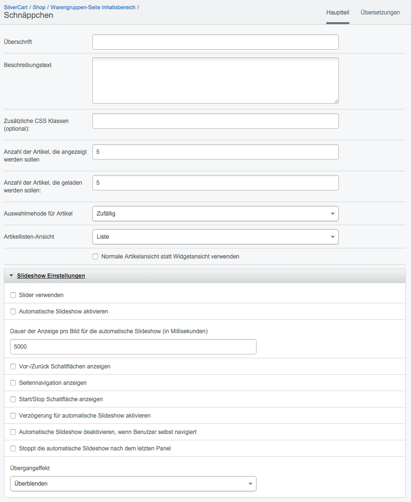

#### Schnäppchen

Mit dem Schnäppchen-Widget können Sie automatisiert die Produkte bewerben, die im Vergleich zur UVP (UnVerbindliche Preisempfehlung des Herstellers) die größte Preisdifferenz haben.

Das Widget errechnet dabei selbständig die Differenz zwischen dem (kundengruppenabhängigen) Verkaufspreis und der UVP jedes einzelnen Artikels im Webshop. Über das Dropdown-Feld Auswahlmethode für Produkte können Sie definieren, ob die Sortierung nach Preisdifferenz aufsteigend oder Preisdifferenz absteigend erfolgen soll.

##### Überschrift
In das Textfeld Überschrift können Sie eine passende Überschrift für Ihre Angebote eintragen.

##### Beschreibungstext
Der Beschreibungstext wird unter der Überschrift angezeigt. Sie können den Text frei verändern und somit ihre Kunden gezielt ansprechen. HTML-Optionen sind in der Beschreibung nicht möglich.

##### Zusätzliche CSS-Klassen
Sie können dem Widget zusätzliche CSS-Klassen zuordnen, um damit die Darstellung individuell zu beeinflussen. Die CSS-Klassen müssen mit den entsprechenden Attributen in einer der CSS-Dateien hinterlegt sein.

##### Anzahl der Artikel, die angezeigt werden sollen 
##### Anzahl der Artikel, die geladen werden sollen
Wenn Sie keinen Slider verwenden, können Sie das Feld Anzahl der Artikel, die angezeigt werden sollen frei lassen. Es werden alle Artikel angezeigt, die auch geladen werden.

##### Auswahlmethode für Artikel
Mit dieser Einstellung können Sie definieren, ob die Sortierung nach Preisdifferenz aufsteigend oder Preisdifferenz absteigend erfolgen soll.

##### Artikellisten-Ansicht
Wenn mehrere Artikellisten-Ansichten definiert wurden, dann können sie diese hier auswählen. SilverCart wird mit der Listenansicht ausgeliefert. In der
Listenansicht werden alle Produkte untereinander dargestellt. Um eigene Ansichten zu erstellen sind Kenntnisse der SilverStripe-Template-Engine notwendig.

##### Normale Artikelansicht statt Widgetansicht verwenden
Wenn Sie diese Option wählen, dann werden die Produktlisten im Slider genau so dargestellt, wie die Produktlisten in den Warengruppen.

SilverCart ermöglicht es Ihnen, hier ein anderes Design zu verwenden um die Schnäppchen hervorzuheben. Das Template für diese neue Design  gehört nicht zum Lieferumfang

Für den Fall, dass Sie einen Slider einsetzen wollen, müssen Sie beide Felder pflegen. Die Anzahl der Artikel, die geladen werden sollen, muss dabei größer sein, als die Anzahl der angezeigten Artikel: es ist ja der Sinn des Sliders, durch eine Menge von Produkten blättern zu können.

#### Slideshow Einstellungen

##### Slider verwenden
Aktivieren Sie den Slider über die Checkbox Slider verwenden. 

##### Automatische Slideshow aktivieren
Wenn Sie Automatische Slideshow aktivieren auswählen, dann beginnt der Slider automatisch durch die Einträge zu blättern. Die Dauer der Anzeige pro Bild für die automatische Slideshow gibt dabei an, wie lange die Artikel dargestellt werden bis weiter geblättert wird. Die Dauer wird in Millisekunden angegeben (1 Sekunde entspricht 1000 Millisekunden). 
Experimentieren Sie mit der Anzeigedauer. Der Slider sollte dem Besucher genügend Zeit lassen um die dargestellten Einträge zu erkennen. Auf der anderen Seite soll die Pause nicht zu lange sein, damit die automatische Slideshow auch die gewünschte Aufmerksamkeitswirkung erzeugen kann.

##### Dauer der Anzeige pro Bild für die automatische Slideshow (in Millisekunden)

##### Vor-/Zurück Schaltflächen anzeigen

##### Seitennavigation anzeigen

##### Start/Stop Schaltfläche anzeigen

##### Verzögerung für automatische Slideshow aktivieren

##### Automatische Slideshow deaktivieren, wenn Benutzer selbst navigiert

##### Stoppt die automatische Slideshow nach dem letzten Panel

##### Übergangseffekt
* Überblenden 
* horizonzal schieben
* vertikal schieben

#### Übersetzungen
Rechts oben am Seitenrand haben Sie vielleicht schon den Tab Übersetzungen entdeckt. Von Übersetzungen in SilverCart haben Sie mittlerweile schon mehrmals gelesen, deshalb will ich an dieser Stelle nicht schon wieder damit anfangen - die Mehrsprachigkeit können Sie in den unterschiedlichen Bereichen immer nach diesem Schema pflegen.