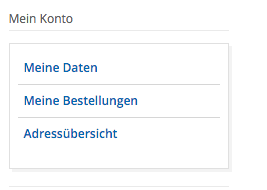

### Anmeldung
Mit dem Anmeldungs-Widget können Sie die Anmelde-Funktion im Inhaltsbereich oder in der Seitenleiste einblenden.
Das Widget ist optimiert für die Darstellung in der Seitenleiste

Sie können an dem Anmeldungs-Widget zusätzliche CSS-Klassen hinterlegen. Weitere Konfigurationsmöglichkeiten sind nicht
notwendig.

In der folgenden Abbildung sehen Sie das Anmeldungs-Widget in der Seitenleiste.

Nach erfolgter Anmeldung, werden die Navigations des Kundenkontos anstelle des Login-Formular angezeigt.

