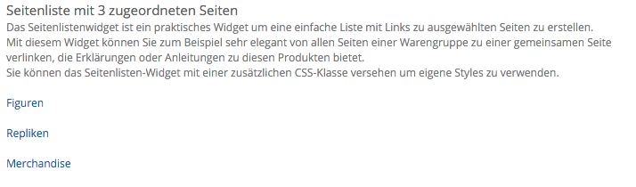

#### Seitenliste
Das Seitenlistenwidget ist ein praktisches Widget um eine einfache Liste mit Links zu ausgewählten Seiten zu erstellen. 

Mit diesem Widget können Sie zum Beispiel sehr elegant von allen Seiten einer Warengruppe zu einer gemeinsamen Seite verlinken, die Erklärungen oder Anleitungen zu diesen Produkten bietet. 
Sie können das Seitenlisten-Widget mit einer zusätzlichen CSS-Klasse versehen um eigene Styles zu verwenden.

Das Widget können Sie im Inhaltsbereich und in der Seitenleiste platzieren. Das folgende Bild zeigt das Seitenleisten-Widget im Inhaltsbereich:

Hauptteil
##### Überschrift
In das Textfeld Überschrift können Sie eine passende Überschrift für das Widget eintragen.

##### Beschreibungstext
Der Beschreibungstext wird unter der Überschrift angezeigt. HTML-Optionen sind in der Beschreibung nicht möglich.

##### Zugeordnete Seiten
Über dieses Menü können Sie die Seiten auswählen, zu denen das Widget verlinken soll.

##### Zusätzliche CSS-Klassen
Sie können dem Widget zusätzliche CSS-Klassen zuordnen, um damit die Darstellung individuell zu beeinflussen. Die CSS-Klassen müssen mit den entsprechenden Attributen in einer der CSS-Dateien hinterlegt sein.

##### Übersetzungen

Hier können Sie eine sprachabhängige Übersetzung zum Widget erstellen. Sie können die Felder Überschrift und Beschreibungstext übersetzen. Die verlinkten Seiten werden automatisch in der 
passenden Sprache verlinkt, sofern Übersetzungen vorhanden sind.
Wenn Sie für jede Sprache eine eigene Seitenliste anlegen möchten, dann können Sie eine Kopie des Widgets für jede Sprache erstellen und dieses dann in der gewünschten 
Sprache einbinden. Über diese Methode können Sie dann auch festlegen, ob das Widget in einer Sprache überhaupt angezeigt werden soll.