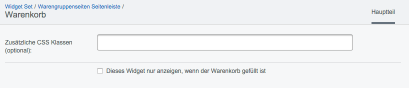
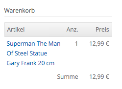
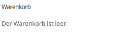

### Warenkorb
Platzieren sie einen Mini-Warenkorb mit dem Warenkorb-Widget. Das Widget eignet sich inbesondere als Widget für die Seitenleiste.

Warenkorb-Widget Ansicht im Frontend

##### Zusätzliche CSS-Klassen
Sie können dem Widget zusätzliche CSS-Klassen zuordnen, um damit die Darstellung individuell zu beeinflussen. Die CSS-Klassen müssen mit den entsprechenden Attributen in einer der CSS-Dateien hinterlegt sein.

##### Dieses Widget nur anzeigen, wenn der Warenkorb gefüllt ist
Bei einem leeren Warenkorb erscheint der Text *Der Warenkorb ist leer.*

Mit dieser Option können sie steuern, dass das Widget nur angezeigt wird, wenn Produkte im Warenkorb vorhanden sind.