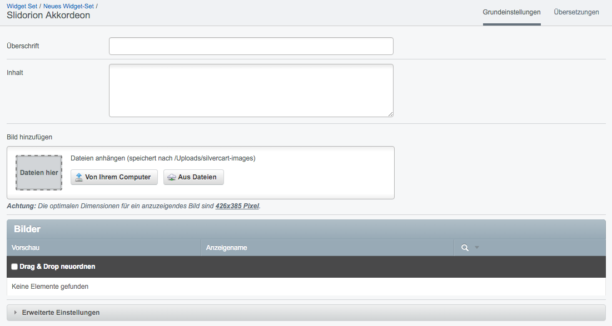

### Slidorion Akkordeon

Mit diesem Widget können Sie ganz einfach einen Slider erstellen und mit Bildern oder Produkten befüllen.

** Überschrift **

** Titel **

** Bild hinzufügen **

#### Erweiterte Einstellungen

** Animationsgeschwindigkeit ** 

Geschwindigkeit der Animation in Millisekunden. 
Standardwert: 500ms

** Dauer eines Übergangs **

Standardwert: 3000ms

** Effekt ** 

Standardwert: fade
Auswahlmöglichkeiten:

* fade
* slideLeft
* slideRight
* slideUp
* slideDown
* overLeft
* overRight
* overUp
* overDown
  
** Pausieren, wenn sich der Mauszeiger über dem Widget befindet **

** Automatisch starten **