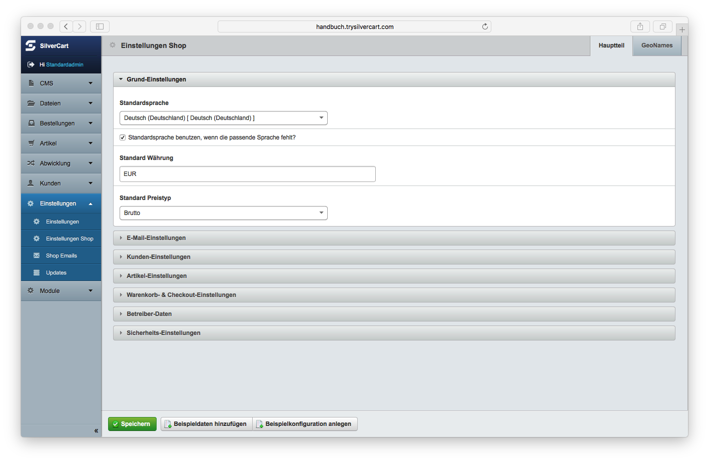
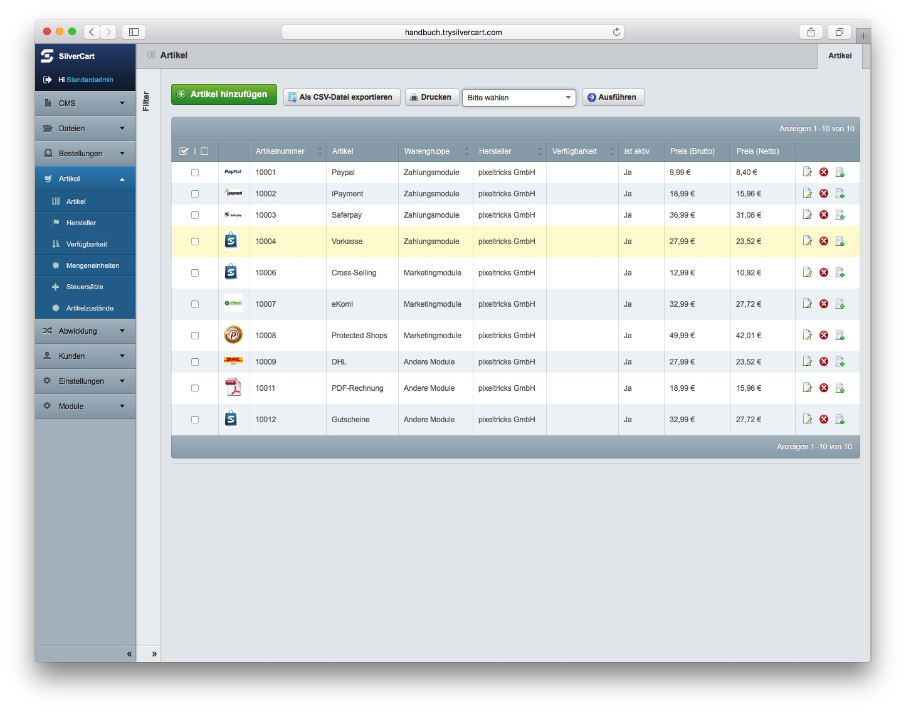
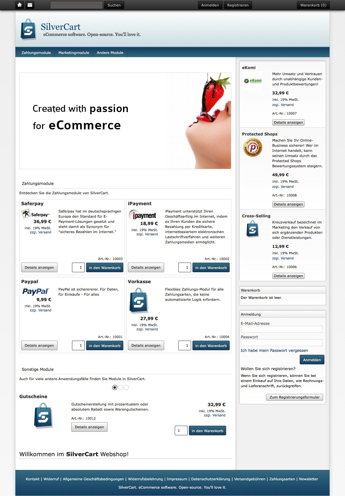

# Einrichtung
Nachdem Sie SilverCart erfolgreich auf Ihrem Webserver installiert haben oder eine von uns gehostete Installation nutzen, ist die Einrichtung der letzte Schritt vor der Inbetriebnahme Ihres Webshops. Bei der Einrichtung geht es darum, Ihren SilverCart-Webshop an Ihre Vorstellungen anzupassen und rechtliche Vorgaben einzuhalten. Ausserdem wirkt Ihr neuer Shop so ganz ohne Produkte noch etwas verlassen:

In SilverCart sind viele Objekte miteinander verknüpft. Ein Steuersatz wird beispielsweise mit mehreren Produkten verknüpft. Diese Vorgehensweise hat den Vorteil, dass bei einer Änderung des Steuersatzes automatisch alle verknüpften Produkte direkt den neuen Wert beziehen. 

Der Zusammenhang ist klar: wenn kein Steuersatz existiert, dann können Sie diesen nicht am Produkt hinterlegen. 
Bevor Sie ein Produkt anlegen, sollten Sie deshalb vorher den benötigten Steuersatz anlegen um sich unnötige Arbeit zu sparen. 
Das gilt auch für Versandarten und Zahlungsarten, die Sie erstellen und dann miteinander verknüpfen. 

Um die verschiedenen Abhängigkeiten aufzulösen ist eine besondere Reihenfolge bei der Einrichtung notwendig. Wenn Sie diese Reihenfolge nicht einhalten, dann werden Sie öfter zwischen den einzelnen Menüpunkten hin- und herspringen müssen um die fehlenden Einträge nachträglich vorzunehmen.

Deshalb haben Sie zusätzlich die Möglichkeit, eine Beispielkonfiguration zu laden um diese dann nach Ihren Vorstellungen anzupassen. 

## Warmstart: Beispieldaten und Beispielkonfiguration laden
Navigieren Sie zur Seite "Einstellungen" und dann zu "Einstellungen Shop". Am Seitenende befinden sich 2 Buttons um die Beispieldaten und die Beispielkonfiguration anzulegen.

### Beispieldaten hinzufügen
Fügen Sie Beispieldaten hinzu, um automatisch einige Warengruppen mit Produkten sowie die die zugehörigen Steuersätze und Hersteller anzulegen. Diese könnn Sie jederzeit ändern oder löschen. Wahrscheinlich finden Sie es einfacher, ein bestehendes Produkt zu ändern als ein neues Produkt anzulegen.

Ausserdem werden verschiedene Widgets erzeugt und auf der Startseite platziert. Damit erstrahlen der Inhaltsbereich und die Seitenleiste der Startseite Ihres neuen Shops direkt in neuem Glanz:

### Beispielkonfiguration anlegen
Legen Sie eine Beispielkonfiguration an, um automatisch Zahlungsarten, Versandarten und Frachtführer zu erzeugen. Auch diese Einträge können Sie jederzeit ändern oder löschen. Bevor Sie einen Eintrag löschen, müssen Sie sicher sein, dass keine Verknüpfungen mehr zu diesem Eintrag bestehen. 

## Kaltstart: Einrichtung ohne Hilfsmittel
Wenn Sie ohne Beispieldaten und ohne Beispielkonfiguration starten wollen, sollten Sie die folgende Reihenfolge bei der Erstellung einhalten um sich unnötige Arbeit zu sparen:

Produktbezogene Objekte:
- Mengeneinheiten
- Steuersätze
- Hersteller
- Artikelzustände
- Warengruppen

Abwicklungsbezogene Objekte:
- Zonen
- Länder aktiveren
- Zahlarten
- Frachtführer
- Versandart

**Was tun, wenn es klemmt?**
Frachtgruppen, Zonen, Länder, Versandarten - hier kann man schnell den Überblick verlieren. Wenn etwas nicht so läuft, wie Sie es sich vorstellen, dann liegt das wahrscheinlich daran,
dass eine Einstellung oder eine Zuordnung fehlt. Oder dass eben genau eine solche Einstellung den gewünschten Erfolg vereitelt, weil eine Einstellung ein Ausschlusskriterium ist. Das ist allerdings nicht immer offensichtlich.

Beispiel: Eine Zahlungsart kann an eine Versandart gebunden werden. Das bedeutet, dass die Zahlart nur ausgewählt werden kann, wenn die verknüpfte Versandart ausgewählt wurde.
Für den Fall, dass die Versandart nicht ausgewählt werden kann, da z.B. kein gültiges Zielland gewählt wurde, dann lässt sich auch die Zahlart nicht auswählen.

Dies ist wichtig, da beispielsweise die Zahlart Nachnahme nicht mit jeder Versandart und dann auch nicht in jedes Land gewählt werden kann, da der Frachtführer das schlichtweg nicht anbietet.

Auch hebelt beispielsweise die Einstellung "Versandkostenfrei ab xxx €" alle Versandkostenberechnungen aus, wenn der Warenkorb diesen Betrag erreicht. 

