# Das SilverCart Back-End

Das Back-End ist der Administrationsbereich von SilverCart. Das Back-End ist nicht-öffentlich und nur für Administratoren mit einem gültigen Benutzernamen und einem Passwort erreichbar.

Der Gegenspieler zum Back-End ist der öffentliche Bereich, der für alle Besucher sichtbar ist. Das ist das Front-End. Dieser Bereich wird manchmal auch „store front“ genannt.

Sie erreichen den Administrationsbereich, wenn Sie der Basisadresse Ihrer SilverCart-Installation ein "/admin" hinzufügen, z.B. `www.meinedomain.de/admin`

Es öffnet sich eine Seite mit dem Login-Fenster. Mit Ihrer E-Mail-Adresse und Ihrem Passwort können Sie sich anmelden.

Im Back-End können Sie die folgenden Aufgaben erledigen:

* Konfiguration des Webshops und der Zahlungsarten
* Erstellung von Währungen, Steuersätzen, Frachtkosten
* Anpassung der Vorlagen für E-Mails (z.B. Bestellbestätigungen)
* Pflege der Warengruppen und der Artikel
* Pflege der Inhaltsseiten (Content)
* Konfiguration und Pflege von optionalen Modulen (Blog, Forum, etc.)
* Bearbeitung von Kundendaten und Bestellungen
* Import- und Export von Produktdaten

Für die manche Aufgabenbereiche gibt es eigene Reiter in der Navigation, andere sind in Unterpunkten zusammengefasst.

Zur besseren Übersicht ist das Back-End aufgeteilt in die Hauptbereiche

* CMS
* Dateien
* Bestellungen
* Artikel
* Abwicklung
* Kunden
* Einstellungen
* Module

Die Menüpunkte können in Ihrem Back-End abweichen, wenn Sie zusätzliche Module installiert haben oder bei Ihrem Benutzerkonto der Zugang zu bestimmten Modulen gesperrt ist.

# Tab CMS

Mit SilverCart haben Sie nicht nur einen Online-Shop, sondern auch ein vollwertiges CMS mit umfangreichen Funktionen, das mit weiteren Modulen erweitert und sogar als Forum genutzt werden kann.

Im folgenden Kapitel erlernen Sie die Grundlagen im Umgang mit dem CMS und erfahren, wie Sie neue Seiten anlegen und bestehende Seiten verändern können.

## Seitentypen

Seitentypen bilden das Rückgrat des CMS und der SilverCart-Shopsoftware. Sie sind in integraler Bestandteil der Philosophie des Systems. Bei der täglichen Arbeit mit dem CMS und der Showsoftware ist es deshalb hilfreich, das Konzept der Seitentypen zu kennen.

Eine moderne Website (ein Online-Shop ist eine spezielle Website) besteht aus vielen einzelnen Seiten. Dabei müssen diese Seiten unterschiedliche Aufgaben erfüllen: es gibt Kontaktformulare, Übersichtsseiten, Artikeldetailseiten, Warenkorbseiten und beispielsweise die verschiedenen Funktionen im Kundenkonto.
Diese besonderen Seiten werden durch Seitentypen abgebildet. 

Ein Seitentyp ist sozusagen ein eigens entwickelter Container, der sich aus Inhalt, Gestaltung und Verhalten definiert. 

Dabei lassen sich alle Seitentypen von einer Grundform ableiten. Das bedeutet, das alle Seitentypen die Basiseigenschaften einer einfachen CMS-Seite erben.

Im Backend können Sie bestehende Seitentypen verwenden und darauf basierende Seiten mit den möglichen Inhalten pflegen. Oftmals haben Seitentypen eigene Pictogramme, die einen Hinweis auf die Verwendungsart geben.

Die Anpassung bestehender Seitentypen und die Entwicklung neuer Seitentypen kann nicht im Backend erfolgen. Hierfür muss ein Entwickler auf Quelltextebene in die Programmierung eines bestehenden Seitentyps eingreifen oder einen neuen Seitentyp entwickeln. 

Für die Anpassung und die Entwicklung von Seitentypen sind Erfahrungen mit der Programmiersprache PHP und dem PHP-Framework SilverStripe bzw. Kenntnisse in HTML und CSS notwendig. Ein empfehlenswerter Einstiegspunkt für die Entwicklung ist die Startseite der SilverStripe Dokumentation http://docs.silverstripe.org/en/3.1/

Seitentyp			Zweck
Seite

## Anatomie einer Seite

Der ursprünglichste Seitentyp ist die „Page“. Eine Page enthält keine besondere Funktionalität und ist ein einfacher Container für einige Grundfelder.
Diese Felder können verschiedene Arten von Informationen speichern. So kann ein Textfeld beispielsweise nur umformatierten Text speichern, während ein HTML-Feld umfangreich formatierten Text, Hyperlinks zu anderen Seiten und sogar Bilder speichern kann.

Aus technischer Sicht sind alle anderen Seitentypen sozusagen Nachfahren des Seitentyps Page und teilen sich bestimmte Eigenschaften, wie z.B. die Einbindung in den Seitenbaum und damit die Möglichkeit eine Hierarchie erstellen zu können.

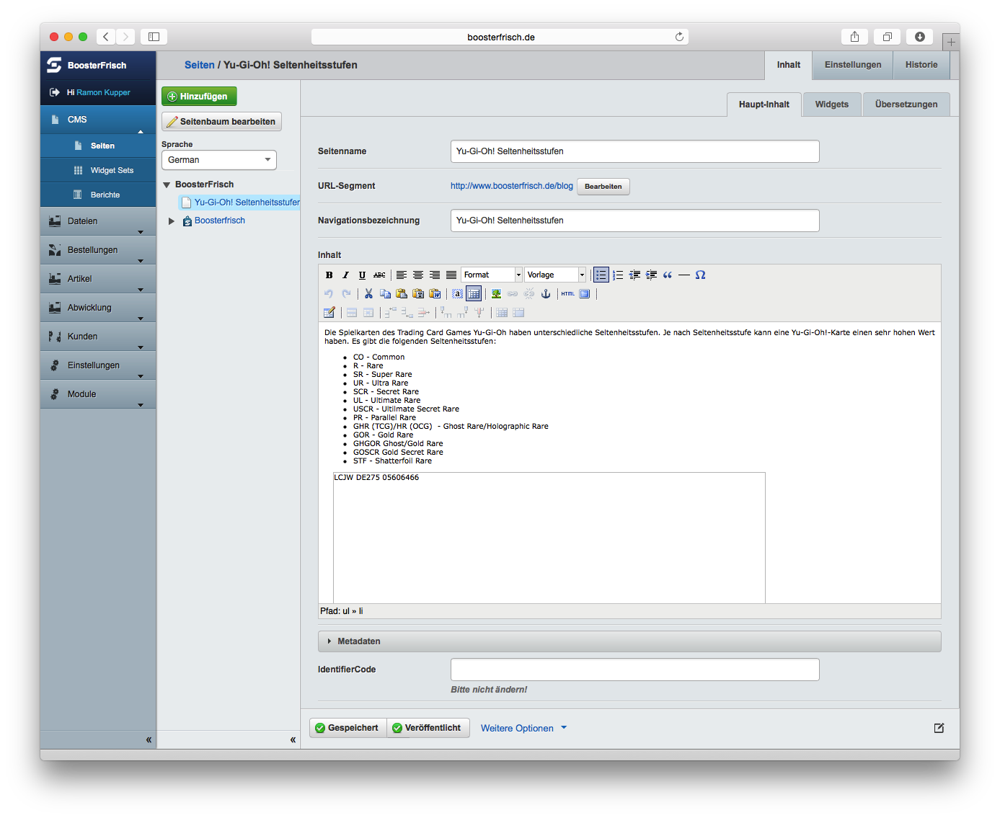
Seitenname (Textfeld)
In diesem Feld können Sie den Namen der Seite pflegen. Der Name der Seite wird im Browser in der Titelleiste angezeigt. Finden Sie einen aussagekräftigen Namen, der hilfreich für Besucher und Suchmaschinen ist. Da es sich um ein Textfeld hab

URL-Segment (Textfeld)
Das URL-Segment ist ein Teil der Adresse, unter der diese Seite erreichbar ist. Achten Sie hier auf Aspekte der Suchmaschinenoptimierung, denn die URL und darin enthaltene Keywords werden von Suchmaschinen ausgewertet.
 
Das URL-Segment ist hierarchisch aufgebaut, deshalb sind der Seitenadresse die URL-Segmente der übergeordneten Seiten vorangestellt. Ändert sich das URL-Segment einer Seite, dann ändert sich auch der Pfad zu untergeordneten Seiten.

Navigationsbezeichnung (Textfeld)
Die Navigationsbezeichnung wird in Menüs im Front-End und auch im Seitenbaum des Back-Ends angezeigt. In der Regel werden Sie hier den Seitennamen verwenden. Passen Sie die Navigationsbezeichnung an, wenn der Seitenname zu lang oder als Menüeintrag ungeeignet ist.

Inhalt (HTML-Feld)
Das Inhaltsfeld - oft auch Content genannt - ist der eigentliche Inhalt der Seite. Deshalb stellt Ihnen das CMS hier einen mächtigen WYSIWYG-Editor (What You See Is What You Get) zur Verfügung, mit dem Sie Ihren Text umfangreich formatieren können und sogar Grafiken, Tabellen, Videos einbinden können.

Meta-Daten
Die Meta Beschreibung und die Benutzerdefinierten Meta-Tags sind hilfreich für eine gute Platzierung in den Suchmaschinenergebnissen. Es lohnt sich, die Meta-Description mit sinnvollen Inhalten zu füllen.

IdentifierCode
Manchmal ist es für das Shopsystem wichtig, eine bestimmte Seite eindeutig bestimmen zu können, selbst wenn diese von Ihnen verändert wurde. 

Ein Beispiel hierfür ist die Bestellbestätigungsseite, die angezeigt wird, wenn ein Kunde seine Bestellung erfolgreich abgeschlossen hat. Diese Seite können Sie frei° mit Inhalten füllen. Da Sie dabei auch den Seitennamen und die Navigationsbezeichnung ändern können, sind diese nicht eindeutig. Deshalb gibt es mit dem IdentifierCode die Möglichkeit, einer Seite eindeutig zu referenzieren. 

In den meisten Fällen kann dieses Feld leer bleiben, wenn weder der Shop noch einzelne Module gezielt auf eine Seite zugreifen müssen. Es ist wichtig, dass Sie keine Änderungen an bestehenden Einträgen vornehmen, denn dadurch können bestimmte Funktionen ausgehebelt werden.

Unterseiten dieser Seite bilden Haupt-Navigation
Die Haupt-Navigation, welche bei Grund-Installation die Warengruppen beinhaltet, wird aus den Unterseiten dieser Seite gebildet. Es darf nur eine Seite geben, die diese Einstellung aktiv hat.

Diese Einstellung ist hilfreich, wenn Sie Ihre Warengruppen-Hierarchie überarbeiten und ohne Zeitverlust zwischen einer parallel erstellen Hierarchie umschalten möchten.

## Der Editor TinyMCE

Der im CMS integrierte Editor TinyMCE (Tiny Moxiecode Content Editor) ist ein auf JavaScript basierter WYSIWYG-Editor. TinyMCE wurde erstmals 2004 veröffentlicht und seit dem stetig weiter entwickelt und verbessert. 

Mit Hilfe von TinyMCE können Sie ohne HTML-Kenntnisse Seiten und Beiträge im CMS verfassen. Hierbei wird Ihre Eingabe in der Textbox von JavaScript in Echtzeit in HTML-Code umgesetzt und als Vorschau ausgegeben. Die Bedienung ist einfach und orientiert sich stark an Microsoft Word.

http://www.cedis.fu-berlin.de/cms/faq/tinymce.html
http://www.contao-handbuch.de/der-rich-text-editor-tinymce.html
http://www.hasecke.com/plone-benutzerhandbuch/4.0/gui/tinymce.html
http://community.shopware.com/Editor-TinyMCE-Editor_detail_788.html
http://openbook.rheinwerk-verlag.de/joomla15/joomla_03_frontend_003.htm
http://doku.factlink.net/1128022.0/

## Seiten

Unter dem Menüpunkt Seiten verwalten Sie den Seitenbaum Ihres Webshops. Die Darstellung der Elemente im Back-End ist hierarchisch. Die Reihenfolge im Back-End ist jedoch nicht zwingend identisch mit der Anzeige im Frontend. Je nach Layout und Design des Ihres Webshops kann die Reihenfolge im Frontend und im Back-End unterschiedlich sein. 

Mit der Schaltfläche „Seite erstellen“ können Sie eine neue Seite anlegen. Es gibt je nach installierten Modulen ganz unterschiedliche Seitentypen. In SilverCart werden z.B. die Warengruppen über Seitentypen abgebildet.

Seitentypen sind ein grundlegendes Konzept und einer der Vorteile des CMS SilverStripe.

Mit einem Klick auf das +-Zeichen des Knotens machen Sie Unterseiten im Seitenbaum sichtbar. Durch einen Klick auf die Überschrift der gewünschten Seite könne Sie diese bearbeiten.

Warengruppen können Sie in beliebiger Tiefe verschachteln. SilverCart erstellt die Navigation und Übersicht der Warengruppen vollautomatisch.

An dieser Stelle können Sie keine Produkte pflegen. Die Pflegemaske für Produkte finden Sie unter SilverCart Administration -> Artikel

Warenkorb / zur Kasse

Über diesen Menüpunkt können Sie die Metadaten (Meta-Title, Meta-Description und Meta-Keywords) der Warenkorbseite und der Checkoutseite pflegen. Ausserdem kann das URL-Segment der Seiten gepflegt werden.

Mein Konto

Dies ist der persönliche Bereich Ihrer Shopkunden. Hier kann der Shopkunde seine persönlichen Daten, seine bisherigen Bestellungen und seine Liefer- und Rechnungsadressen zu verwalten.

Auch hier können Sie die Metadaten und die URL-Segmente pflegen.

Grundsätzlich besteht die Möglichkeit, hier auch Inhalte zu pflegen, die im Frontend angezeigt werden können. Da dies wegen der dynamischen Erzeugung jedoch fortgeschrittene Kenntnisse erfordert, nutzen wir diese Möglichkeit nur in Einzelprojekten.

Metanavigationsübersicht

In der Metanavigationsübersicht können Sie die Hilfsseiten pflegen Hilfsseiten sind Seiten mit Inhalt, die zwar für den (rechtssicheren) Betrieb des Webshops unerlässlich sind, aber nicht in einer klassischen Navigationsstruktur dargestellt werden sollen. Die Inhalte dieser Seiten können Sie mit Ausnahme von Kontakt und Versandgebühren selbst pflegen. Auch die Metadaten und die URL-Segmente können Sie bei diesen Seiten verändern.

In einer SilverStripe-Grundinstallation wird jede Seite über das URL-Segment eindeutig identifiziert. Da viele Seiten intern miteinander verlinkt sind, würde eine Veränderung des URL-Segments zu Fehlern führen. Deshalb sind die Seiten intern über das Feld IdentifierCode verbunden, unabhängig vom URL-Segment. Ändern Sie den Wert für den IdentifierCode nicht!

Footernavigationsübersicht

Die Footernavigationsübersicht gruppiert die Seiten, die im Footer verlinkt werden sollen. Es gibt zwar die Möglichkeit, diese hartkodiert im Template zu verlinken, doch würden Sie sich damit einiger Flexibilität berauben. Denn Änderungen in der Reihenfolge oder der Linktexte sind damit nicht mehr bequem möglich.

Hartkodiert bedeutet, dass die Links direkt als HTML in der Template-Datei stehen. Mit Template-Dateien können Entwickler und auch viele Designer besser und vor allem effizienter umgehen. Der technisch weniger versierte Redakteur wird diese Möglichkeit in der Regel nicht nutzen können. Unsachgemäße Änderungen im Template können den ganzen Shop lahmlegen.
Hier gibt es keine goldene Regel. Je nach Projekt, Anforderungen und Fertigkeit kann hier ganz individuell vorgegangen werden.

Registrierungsseite

Über diesen Menüpunkt können Sie die den Content, Metadaten (Meta-Title, Meta-Description und Meta-Keywords) der Willkommen-Seite und die Registrierungsbestätigungsseite pflegen. Ausserdem kann das URL-Segment der Seiten gepflegt werden. Die darunter liegende Willkommen-Seite wird angezeigt nachdem sich ein Besucher erfolgreich im Shop registriert hat.

Newsletter Status / Newsletteranmeldung abschließen

Diese Seiten sind Bestandteil der SilverStripe Grundinstallation. Sie können Inhalt, Metadaten und URL-Segment verändern.

Die "Newsletter Status" Seite lässt den Kunden wissen, ob er für den Newsletter registriert ist oder ob eine Registrierung noch aussteht.

Über die "Newsletteranmeldung abschließen" Seite lassen sich folgende Texte bezüglich des Newsletters pflegen:

* Standard Text
* Fehlermeldung
* Erfolgsmeldung
* Meldung, dass der Nutzer schon für den Newsletter registriert ist

Seite nicht gefunden / Server error

Sollte eine Seite nicht gefunden werden, weil sich beispielsweise das URL-Segment geändert hat oder die Seite nicht mehr existiert, dann erzeugt SilverStripe den Fehlercode 404 und zeigt den Inhalt an, den Sie unter Seite nicht gefunden selbst pflegen können. Im Falle eines Serverfehlers wird der Fehlercode 500 zurückgeliefert. Auch hier können Sie den Inhalt selbst gestalten.

Nutzen Sie die Möglichkeit, Ihren Kunden im Fehlerfall alternative Links anzubieten oder zumindest eine aussagekräftige Fehlermeldung zu präsentieren.

## Widget Sets

Ein Widget ist ein kleines Programm zur Anzeige von Informationen, z.b. einem bestimmten Artikel aus dem Sortiment oder der Öffnungszeiten. Dabei kann ein Widget auch Informationen annehmen und verarbeiten, z.B. eine Login-Formulart oder ein Formular für eine Newsletter-Anmeldung.

Das Silbenkurzwort Widget ist zusammengesetzt aus Wi(ndow) und (Ga)dget. 

Eine Stärke von Widgets liegt in der Wiederverwendbarkeit. Sie können beliebige Zusammenstellungen von SilverCart-Widgets als Widget-Sets abspeichern und auf bestimmten Seiten Ihres Webshops anzeigen. Dadurch haben Sie eine einfache, aber mächtige Möglichkeit um Ihren SilverCart Webshop optisch anzupassen.

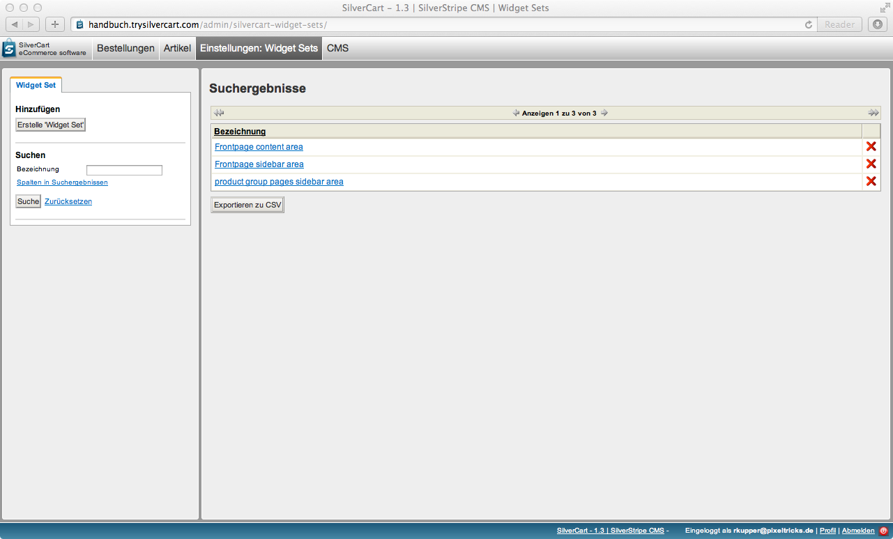

### Widgets

Mit den folgenden Widgets können Sie Ihren Webshop individualisieren:

* Schnäppchen
* Bilder
* Neueste Blogeinträge anzeigen
* Anmeldung
* Seitenliste
* Artikel aus Unterwarengruppen
* Produkte
* Herstellerliste
* Warengruppennavigation
* Slider für Warengruppen
* Suchen Sie etwas?
* Die häufigsten Suchbegriffe
* Warenkorb
* Slidorion Akkordeon
* SilverCart Subnavigation
* Freitext
* Topseller

#### Schnäppchen

Mit dem Schnäppchen-Widget können Sie automatisiert die Produkte bewerben, die im Vergleich zur UVP (UnVerbindliche Preisempfehlung des Herstellers) die größte Preisdifferenz haben.

Das Widget errechnet dabei selbständig die Differenz zwischen dem (kundengruppenabhängigen) Verkaufspreis und der UVP jedes einzelnen Artikels im Webshop. Über das Dropdown-Feld Auswahlmethode für Produkte können Sie definieren, ob die Sortierung nach Preisdifferenz aufsteigend oder Preisdifferenz absteigend erfolgen soll.

In das Textfeld Überschrift können Sie eine passende Überschrift für Ihre Angebote eintragen.

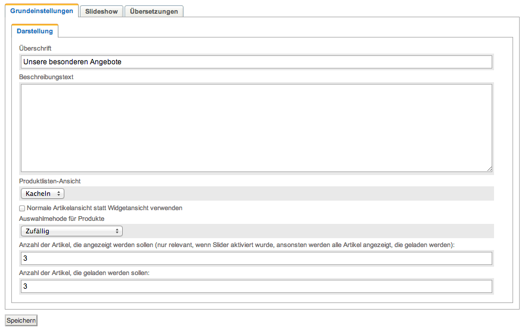

Normale Artikelansicht statt Widgetansicht verwenden
Wenn Sie diese Option wählen, dann werden die Produktlisten im Slider genau so dargestellt, wie die Produktlisten in den Warengruppen.

SilverCart ermöglicht es Ihnen, hier ein anderes Design zu verwenden um die Schnäppchen hervorzuheben. Das Template für diese neue Design  gehört nicht zum Lieferumfang

Die Darstellung der Artikel kann als Kacheln oder als Liste erfolgen. Die beiden folgenden Abbildungen zeigen wie die Artikel im Front-End als Kacheln und als Liste dargestellt werden. 
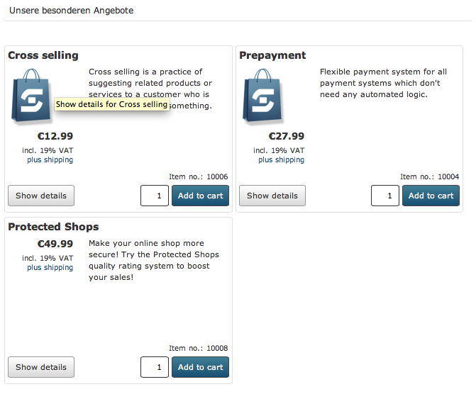
Achten Sie bei der gekachelten Darstellung auf eine gerade Anzahl von Artikeln, da es ansonsten zu einer Lücke kommt. In diesem Beispiel habe ich deshalb absichtlich nur 3 Produkte ausgewählt.

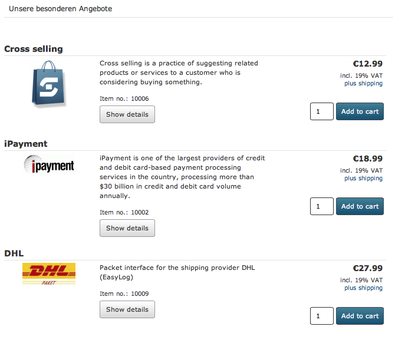
Bei der Listendarstellung spielt es hingegen keine Rolle, wie viele Produkte Sie ausgewählt haben.

Anzahl der Artikel, die angezeigt werden sollen und Anzahl der Artikel, die geladen werden sollen
Wenn Sie keinen Slider verwenden, können Sie das Feld Anzahl der Artikel, die angezeigt werden sollen frei lassen. Es werden alle Artikel angezeigt, die auch geladen werden.

Für den Fall, dass Sie einen Slider einsetzen wollen, müssen Sie beide Felder pflegen. Die Anzahl der Artikel, die geladen werden sollen, muss dabei größer sein, als die Anzahl der angezeigten Artikel: es ist ja der Sinn des Sliders, durch eine Menge von Produkten blättern zu können.

Einstellungen für die Slideshow

Aktivieren Sie den Slider über die Checkbox Slider verwenden. 

Automatische Slideshow aktivieren
Wenn Sie Automatische Slideshow aktivieren auswählen, dann beginnt der Slider automatisch durch die Einträge zu blättern. Die Dauer der Anzeige pro Bild für die automatische Slideshow gibt dabei an, wie lange die Artikel dargestellt werden bis weiter geblättert wird. Die Dauer wird in Millisekunden angegeben (1 Sekunde entspricht 1000 Millisekunden). 
Experimentieren Sie mit der Anzeigedauer. Der Slider sollte dem Besucher genügend Zeit lassen um die dargestellten Einträge zu erkennen. Auf der anderen Seite soll die Pause nicht zu lange sein, damit die automatische Slideshow auch die gewünschte Aufmerksamkeitswirkung erzeugen kann.

Vor-/Zurück Schaltflächen anzeigen

Start/Stop Schaltfläche anzeigen

Automatische Slideshow deaktivieren, wenn Benutzer selbst navigiert

Stoppt die automatische Slideshow nach dem letzten Panel

Übergangseffekt
	Überblenden, horizonzal schieben, vertikal schieben

Verzögerung für automatische Slideshow aktivieren

Übersetzungen
Von Übersetzungen in SilverCart haben Sie mittlerweile schon mehrmals gelesen, deshalb will ich an dieser Stelle nicht schon wieder damit anfangen.

### Widget Set erstellen

Erstellen Sie ein Widget Set über die Schaltfläche "Erstelle 'Widget Set'" und geben Sie diesem einen Namen. (Zum Beispiel "Startseite"). Drücken Sie anschließend auf die Schaltfläche "Hinzufügen" um das neue Widget Set zu erstellen. Im Folgenden erscheinen zwei Boxen, worüber Sie die Widgets zuordnen und bearbeiten können.

Im Feld "Bezeichnung" können Sie dem Set einen Namen geben. Dieser erleichtert es Ihnen, das Set wieder zu finden, wenn sehr viele Widget Sets angelegt sind. Durch Klick auf den Pfeil wird das entsprechende Widget dem Set hinzugefügt und erscheint auf der rechten Seite. Beispielhaft wurde das schon für das Widget "Anmeldung" und "Warengruppen"" gemacht.

Jedes Widget hat kann über den Button "Bearbeiten" individuell eingestellt werden. Die Reihenfolge der Widgets kann über die Buttons "Nach oben schieben" oder "Nach unten schieben" verändert werden.

Wenn Sie Ihr Widget Set fertig konfiguriert haben, dann speichern Sie es mit dem "Hinzufügen" Knopf.

Wenn Sie auf eine Seite im Seitenbaum navigieren, können Sie unter Widgets die erstellten Sets sehen. Widget Sets können dem Inhaltsbereich (linke Spalte des Layout) oder der Seitenleiste (rechte Spalte des Layout) zugeordnet werden.

## Berichte

Über den Menüpunkt "Berichte" könne Sie Ihre Website nach falschen, fehlenden oder defekten Links zu durchsuchen. 

Sie können im Hauptbereich verschiedene Filter setzen um automatisiert nach fehlenden Dateien oder falsch verlinkten Seiten zu suchen. Das System listet diese anschließend auf und Sie können schneller Fehler in Ihrer Seitenstruktur erkennen. Dies ist bei besonders komplexen Seitenbäumen eine sehr hilfreiche Funktion.

Durch die Behebung von fehlerhaften Links ersparen Sie Ihren Besuchern Fehlermeldungen und Sackgassen. Nutzen Sie diese Funktion deshalb regelmässig.

# Tab Dateien

## Dateien & Bilder

In diesem Bereich werden alle gepflegten Produktbilder und Dateianhänge abgelegt.

In der Standardinstallation existiert ein Verzeichnis (Ordner) "Uploads". Sie können beliebig viele neue Verzeichnisse anlegen, indem Sie auf die Schaltfläche "Erstellen" klicken. Verzeichnisse können auch beliebig verschachtelt werden. Über die Schaltfläche "Hinzufügen" können Sie neue Dateien hochladen. Sollten Sie Dateien über einen externen Zugang, zum Beispiel FTP, in eines der Verzeichnisse kopiert haben, betätigen Sie die Schaltfäche "Nach neuen Dateien suchen". Das System erkennt diese neuen Dateien dann automatisch und fügt diese der Datenbank hinzu.

Im rechten Fenster können Sie auswählen, wie viele Dateien auf einmal angezeigt werden wollen. Über die Pfeile in der Kopfzeile können Sie blättern, falls viele Ergebnisse vorhanden sind.

Wenn Sie das Suchfeld benutzen, werden Ihre Eingaben in Echtzeit ausgeführt. Sie müssen also weder die Enter-Taste drücken noch irgend einen anderen Knopf betätigen.

Bitte benennen Sie das Verzeichnis "Uploads" nicht um. Es kann sein, dass dann einige Bilder nicht mehr gefunden werden.

## Bilder

----

# Tab Bestellungen

Unter dem Tab Bestellungen finden Sie alle Aspekte der Bestellverwaltung, der Kontaktanfragen und der Bestellstatusverwaltung.

## Bestellungen

Hier können Sie alle eingegangenen Bestellungen einsehen. Dabei werden die neuesten Bestellungen zuerst angezeigt.

Schnellansicht

Eine sehr praktische Funktion bei der Arbeit mit Bestellungen ist die Schnellansicht.

Fahren Sie einfach mit der Maus über die Lupe in der Zeile um die Schnellansicht für diese Bestellung zu aktivieren. Es öffnet sich ein kleines Fenster mit zusätzlichen Informationen über die einzelnen Positionen der Bestellung.

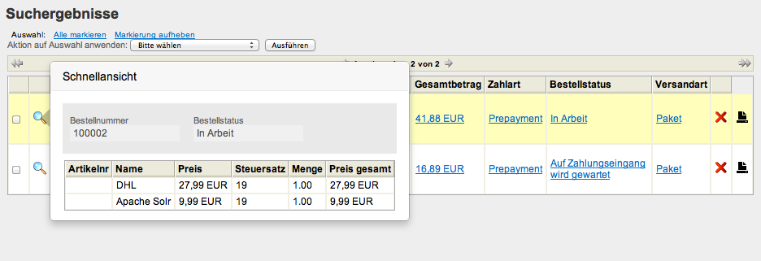

Details zu einer Bestellung

Sie kommen zu den Details einer Bestellung, wenn Sie eine Bestellung aus der Suchergebnisliste anklicken. Auf dieser Seite finden Sie alle Informationen, die im Shopsystem über die Bestellung und den Kunden vorhanden sind.

Die Informationen zu abgeschlossenen Bestellungen liegen im Archiv und können nur über diese Maske geändert werden. Ändern sich nachträglich beispielsweise Produktpreise oder ändert der Kunde seine Lieferadresse, werden die Angaben zum Zeitpunkt der Bestellung dadurch nicht verändert.

Es ist derzeit noch nicht möglich, im Back-End eine neue Bestellung anzulegen. Bestehende Bestellungen können aber nachträglich bearbeitet werden.

### Bestellungen suchen

Über die Suchfunktion lassen sich Bestellungen schnell und komfortabel finden. Im Inhaltsbereich auf der linken Seite können Sie Bestellungen anhand verschiedener Suchkriterien filtern.

Sie können die gefundenen Bestellungen dann einzeln bearbeiten oder mit einer Auswahl von mehreren Bestellungen Massenänderungen durchführen.

#### Suche nach Grunddaten der Bestellung

Bestellnummer
Geben Sie hier die Bestellnummer oder den bekannten Teil der Bestellnummer ein. Dabei werden alle Bestellungen angezeigt, bei denen die angegebenen Ziffernfolge innerhalb der Bestellnummer vorkommt.
 
Bestelldatum
Zum auffinden von Bestellungen anhand des Bestelldatums, klicken Sie auf das Eingabefeld. Es öffnet sich ein Eingabefenster mit den folgenden Auswahlmöglichkeiten:

Heute - zeigt alle Bestellungen des heutigen Tage an
Letzte 7 Tage - zeigt alle Bestellungen der letzten 7 Tage an
Dieser Monat - zeigt alle Bestellungen dieses Monats an
Dieses Jahr - zeigt alle Bestellungen dieses Jahres an
Vorheriger Monat - zeigt alle Bestellungen des Vormonats an
Datum - zeigt alles Bestellungen des ausgewählten Datums an
Alles vor - zeigt alle Bestellungen vor dem ausgewählten Datum an
Alles nach - zeigt alle Bestellungen nach dem ausgewählten Datum an
Zeitraum - zeigt alle Bestellungen an, die innerhalb des ausgewählten Zeitraums eingegangen sind.

Gesehen
Sobald Sie eine Bestellung im Back-End öffnen, wird diese als „gesehen“ markiert. Über diesen Filter können Sie nach gesehenen oder ungesehenen Bestellungen suchen.

Bestellstatus
Nutzen Sie diesen Filter, wenn Sie Bestellungen anhand des Bestellstatus suchen möchten. Sie können auswählen zwischen:

* Auf Zahlungseingang wird gewartet
* Bezahlt
* In Arbeit
* Neu
* Storniert
* Versendet

Wenn Sie zusätzliche Bestellstatus definiert haben, dann erscheinen diese ebenfalls in dieser Liste.

Querverweis: Mehr über die Bestellstatus erfahren Sie im Kapitel Bestellstatus

Zahlart
Hier können Sie die Bestellungen anhand der Zahlart filtern. SilverCart bietet in der Grundinstallation Vorkasse (Prepayment) und Rechnung (Invoice) als mögliche Zahlarten an. Weitere Zahlarten sind über Erweiterungsmodule möglich. 

Versandart
Wie bei der Zahlart, sind auch die Auswahlmöglichkeiten der Versandart abhängig von den definierten Versandarten. 
Querverweis: Mehr über Versandarten erfahren Sie im Kapitel Versandart.

#### Suche nach Kundendaten

Wenn Sie Bestellungen anhand von Kundendaten suchen, dann können Sie die nachfolgenden Kriterien für Ihre Suche verwenden. Für alle Kriterien gilt:
Es werden alle Bestellungen angezeigt, bei denen der angebene Suchbegriff innerhalb des Kriteriums vorkommt. 

Die möglichen Kriterien sind:

* Kundennummer
* E-Mail
* Vorname
* Nachname
* Straße
* Hausnummer
* PLZ
* Ort
* Land

Suche nach Positionsdaten

Über die Positionsdaten finden Sie Bestellungen, die eine bestimmte  Artikelnummer mit der gewünschten Positionsmenge enthalten. Wenn Anzahl des Artikels in der Bestellung keine Rolle spielt, dann lassen Sie dieses Feld einfach leer.

Sollen nur Bestellungen angezeigt werden, die ausschliesslich diesen Artikel enthalten, markieren Sie zusätzlich das Feld Bestellung darf nur angegebene Position enthalten.

#### Sonstiges

Limit
Hier können Sie ein Anzeigelimit eintragen. Falls mehrere Bestellungen gefunden werden, werden nur so viele angezeigt wie hier angegeben wurden. Ist das Feld leer, werden alle Bestellungen angezeigt. Die Blätterfunktion (Paginierung) ist davon unabhängig.

Spalten in Suchergebnissen
Sie können die angezeigten Spalten in den Suchergebnissen selbst bestimmen. Wählen Sie hierfür einfach die gewünschten Spalten an oder ab.

Die möglichen Spalten sind:

* Bestelldatum
* Gesamtbetrag
* Bestellnummer
* Zahlart
* Lieferadresse
* Bestellstatus
* Rechnungsadresse
* Versandart

Sie haben die Möglichkeit, einzelne Spalten aus- oder einzublenden sowie alle Spalten auf einmal aus- bzw. Einzublenden.

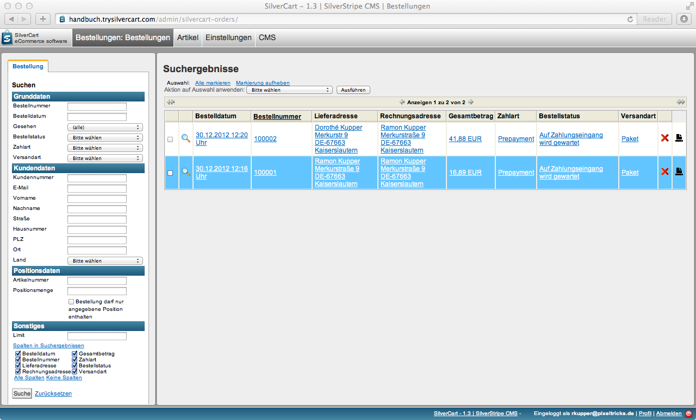

### Bestellungen bearbeiten

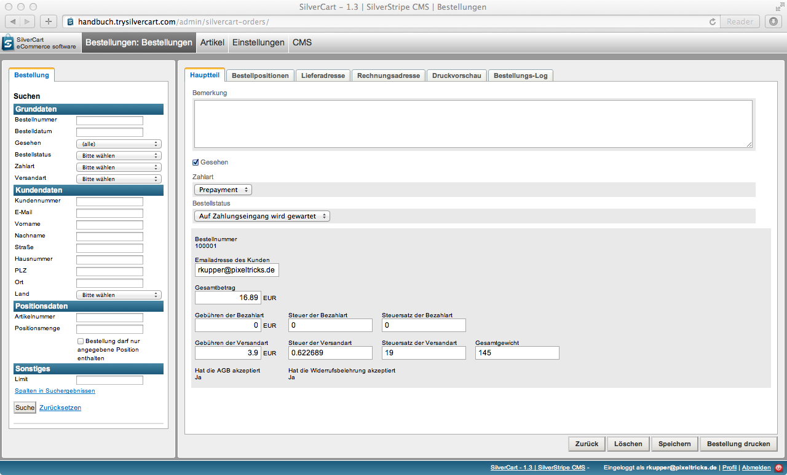

#### Die Tabs einer Bestellung

Sie gelangen in die Detailansicht einer Bestellung, wenn Sie die Bestellung innerhalb der Anzeigeliste anklicken.

In der Detailansicht haben Sie Zugriff auf die Reiter 

* Hauptteil
* Bestellpositionen
* Lieferadresse
* Rechnungsadresse
* Druckvorschau
* Bestellungs-Log

##### Hauptteil

In der Detailansicht einer Bestellung wird zuerst der Hauptteil der Bestellung angezeigt.

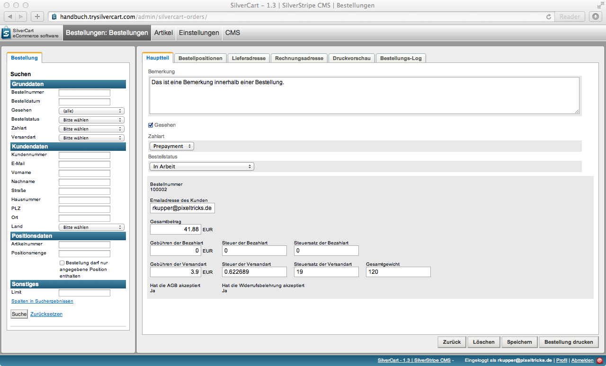

Der Hauptteil zeigt Ihnen die wesentlichen Informationen der Zahlart, des Bestellstatus, Gesamtbetrag und das Gesamtgewicht.

Ausserdem wird das Textfeld „Bemerkung“ angezeigt. Hat der Kunde während der Bestellung eine Bemerkung eingetragen, dann wird diese hier angezeigt. Sie können das Textfeld größer ziehen, in dem Sie auf den dreieckigen Anfasser im rechten unteren Eck des Bemerkungsfelds klicken und mit gedrückter Maustaste die Größe verändern.

Sie können diesen Text nachträglich verändern oder ergänzen. Bedenken Sie aber, dass der Kunde darüber nicht informiert wird und es somit dem Zufall überlassen bleibt, ob er diese Änderung jemals lesen wird.

##### Bestellpositionen

Im Reiter Bestellpositionen erhalten Sie detaillierte Auskunft über die einzelnen Artikel der Bestellung.

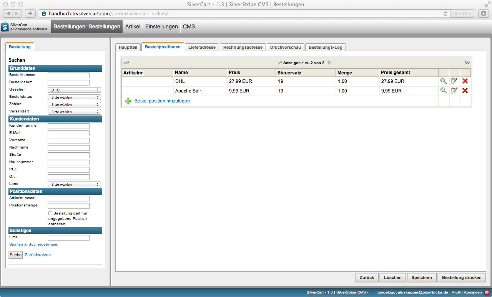

Darüber hinaus können Sie auch einzelne Positionen bearbeiten, löschen oder neue Artikel hinzufügen. Solche Änderungen an der Bestellung sind in der Regel nicht notwendig und ziehen oft weitere Maßnahmen nach sich. So sollten beispielsweise eine Gutschrift (falls der Gesamtbetrag schon gezahlt wurde) oder eine veränderte Rechnung erstellt werden. 

##### Lieferadresse

Im Reiter Lieferadresse werden die Angaben des Kunden zur Lieferanschrift angezeigt. 

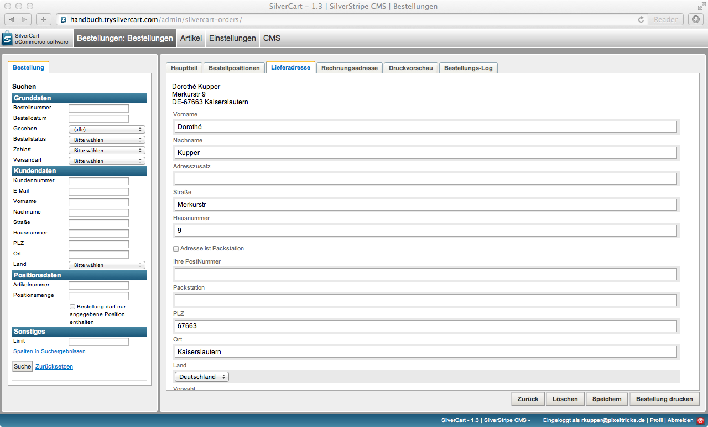

Sie können die Lieferadresse auch nachträglich noch verändern. Dies kann notwendig sein, wenn der Kunde seine Adresse falsch eingetragen hat. Es kommt gelegentlich vor, dass die Hausnummer vergessen wird oder sich ein Zahlendreher bei der Postleitzahl einschleicht. 

##### Rechnungsadresse

Die Rechnungsadresse des Kunden finden Sie im Reiter Rechnungsadresse.

Wie bei der Lieferadresse können Sie auch hier noch nachträglich Änderungen vornehmen.

Die Rechnungsadresse und die Lieferadresse können identisch sein. In diesem Fall finden Sie identische Angaben unter den beiden Reitern.

##### Druckvorschau

Eine für den Druck aufbereitete Zusammenfassung der Bestellung finden Sie unter dem Reiter Druckvorschau.

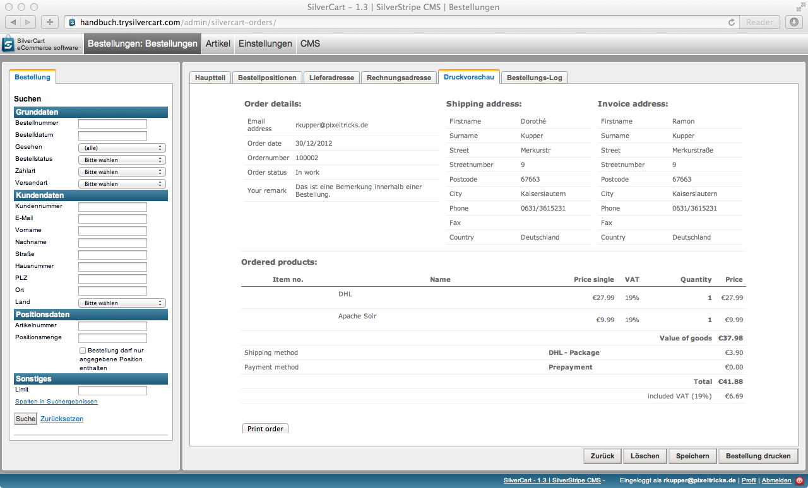

Sie können die Bestellung hier auch ausdrucken um eine einfache picking list zu haben mit der Sie die notwendigen Artikel für die Zusammenstellung der Lieferung aus dem Lager suchen können.

##### Bestellungs-Log

Im Bestellungs-Log werden alle Statusänderungen protokolliert. Somit können alle Änderungen dauerhaft nachvollzogen werden.

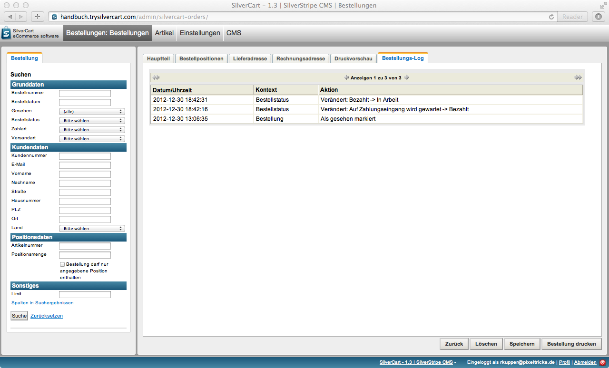

#### Massenänderungen

Über diese Komfort-Funktion können Sie eine definierte Aktion gleichzeitig auf mehrere Bestellungen anwenden. Selektieren Sie hierfür die gewünschten Bestellungen indem Sie die Checkbox auf der linken Seite mit einem Häkchen aktivieren.

Auf die ausgewählten Bestellungen können Sie nun eine der folgenden Aktionen anwenden:

* Bestellung bearbeiten
* Bestellstatus ändern auf
* Bestellungen drucken (HTML)
* Als gesehen markieren
* Als nicht gesehen markieren

#### Bestellungen löschen

Sie können Bestellungen in SilverCart auch endgültig löschen. In manchen Fällen, beispielsweise bei Testbestellungen, wollen Sie Ihre Statistik nicht verfälschen indem Sie diese auf den Status storniert setzen.

Deshalb kann es durchaus sinnvoll sein, bestimmte Bestellungen endgültig zu löschen.

Dies kann entweder über das rote Kreuz in der Bestellübersicht erfolgen oder über den Button Löschen in der Detailansicht einer Bestellung.

## Bestellstatus

Die meisten Bestellstatus werden von den Zahlungsmodulen automatisch angelegt, da die Zahlungsmodule diese Status den Bestellungen auch automatisch zuordnen. Sie können jedoch jeder Zeit eigene Bestellstatus definieren und diese dann Bestellungen, die sie manuell bearbeiten, zuordnen.

----

# Tab Artikel

Unter dem Tab Artikel haben Sie die Möglichkeit Ihr Webshop-Sortiment zu pflegen. 

Neben den Artikeln können Sie auch 
* Hersteller
* Artikelzustände
* Verfügbarkeiten
* Steuersätze und
* Preisportal Exporte verwalten.

## Artikel

Die Verwaltung von Artikeln ist neben der Bestell- und Kundenverwaltung einer der wichtigsten Bereiche in SilverCart. Wenn Sie ein pflegeintensives Sortiment haben, also beispielsweise regelmässige Preisänderungen durchführen oder neue Artikel einpflegen, werden Sie diesen Bereich entsprechend häufig aufsuchen.

Hinweis:
Artikel und Produkt werden synonym verwendet und betriebswirtschaftliche Unterscheidungsdetails ausser acht gelassen.

### Artikelübersicht

In der Artikelübersicht werden alle Artikel Ihres SilverCart Webhops in einer Tabelle dargestellt.

Über die Filter im Inhaltsbereich können Sie die angezeigten Artikel einschränken. Mit SilverCart sind Online-Shops mit mehr als 400.000 Artikeln möglich - ein mächtiger Filter erleichtert Ihnen dabei die tägliche Arbeit wesentlich.

Artikelnummer
Geben Sie hier die Artikelnummer oder einen Teil der Artikelnummer ein. Dabei werden alle Artikel angezeigt, bei denen die angegebenen Ziffern- bzw. Buchstabenfolge innerhalb der Bestellnummer vorkommt. Hier zahlt es sich aus, wenn Sie Ihr Sortiment durch sprechenden Artikelnummern strukturiert haben. Eine sprechende Artikelnummer kann anhand des Aufbaus schon Informationen über Warengruppe, Lieferant, Modelljahr, Material oder Farbe liefern.

Name
In dieses Feld tragen Sie den Namen (Artikelbezeichnung) ein. Es werden alle Artikel aufgeführt, deren Namen ganz oder teilweise mit dem Begriff übereinstimmen, den Sie hier eingetragen haben.

Listenbeschreibung
Wenn Sie die Artikel anhand der Listenbeschreibung (Kurzbeschreibung) filtern möchten, dann tragen Sie hier den gewünschten Suchbegriff ein.

Artikelbeschreibung
Bei der Suche nach Artikeln anhand der Artikelbeschreibung berücksichtigen Sie bitte, dass die Artikelbeschreibung oftmals in HTML erfolgt. Dadurch lässt sich die Artikelbeschreibung ansprechender darstellen, z.B. Durch Fettdruck oder Kursivschrift. Diese Auszeichnungen können dazu führen, dass  längere Phrasen oder Teilsätze nicht gefunden werden, da Sie in der Datenbank mit diesem zusätzlichen Markup versehen sind.

Hersteller
Über dieses Feld können Sie Ihr Sortiment nach den Artikeln eines bestimmten Herstellers Filtern.

Artikelnummer (Hersteller)
Wenn Sie die Herstellerartikelnummer verwenden, dann können Sie diesen Filter nutzen um Artikel anhand der Artikelnummer des Herstellers zu finden.

ist aktiv
Über diese Checkbox können Sie steuern, ob nur aktive oder inaktiv Artikel angezeigt werden sollen.

Warengruppe
Für die Einschränkung Suche auf eine bestimmte Warengruppe wählen Sie aus der Dropdown-Liste einfach die gewünschte Warengruppe aus.

Spiegel-Warengruppen
Mit der Auswahl einer Spiegel-Warengruppe finden Sie die Produkte, die der ausgewählten Spiegel-Warengruppe zugeordnet sind.

Verfügbarkeit
Für die Einschränkung nach verfügbaren oder nicht verfügbaren Produkten wählen Sie hier die gewünschte Einstellung aus.

Spalten in Suchergebnissen
Sie können die in der Übersicht angezeigten Produktinformationen ganz einfach selbst bestimmen. 

Die folgenden Felder stehen Ihnen zur Auswahl zur Verfügung:

* ID
* Währung (Netto)
* Name
* Gewicht
* Listenbeschreibung
* EAN
* Artikelbeschreibung
* ist aktiv 
* Meta Beschreibung für Suchmaschinen
* Min. Bezugsdauer
* Meta Titel für Suchmaschinen
* Max. Bezugsdauer
* Meta Schlagworte für Suchmaschinen
* Einheit (WBZ)
* Artikelnummer
* Lagerbestand
* Artikelnummer (Hersteller)
* Ist der Lagerbestand dieses Artikels überbuchbar?
* Einkaufspreis
* Silvercart Product Group ID
* Währung
* Einkaufspreis
* Silvercart Manufacturer ID
* UVP Silvercart
* Availability Status ID
* Währung
* UVP
* Warengruppe
* Preis (Brutto)
* Hersteller
* Währung (Brutto)
* Verfügbarkeit
* Preis (Netto)
* ist aktiv

Sie haben auch die Möglichkeit, über „Alle Spalten“ oder „Keine Spalten“ mit einem Klick alles aus- bzw. abzuwählen.

Importieren
Die SilverCart Shopsoftware bietet Ihnen die Möglichkeit, Ihre Produktdaten über eine CSV-Datei zu importieren. Welche Werte die Importfunktion erwartet, sehen Sie wenn Sie Spezifikation für SilvercartProduct zeigen wählen.

Mit der Checkbox `Clear Database before import` bestimmen Sie, ob alle Produkte vor dem Import gelöscht werden sollen. Wählen Sie diese Option nur, wenn Sie sich absolut sicher sind.

Zur Sicherheit sollten Sie vorher eine Datensicherung durchführen oder den Import auf einem Stagingsystem probeweise durchführen.

Bilder nachträglich importieren
Über diese Funktion können Sie Produktbilder nachträglich importieren. Die Zuordnung zu den Produkten erfolgt dabei automatisch. Dafür muss der Dateiname einer bestimmten Konvention entsprechen. 

Um den Import durchzuführen, müssen Sie die Bilder in einem Verzeichnis auf dem Server liegen auf dem auch Ihr SilverCart Webshop läuft. Den Pfad tragen Sie bitte in dem Format 
/var/www/silvercart/images/ 
ein.

Starten Sie den Import mit dem Button Bilder importieren.

### Artikeldetail

Sie gelangen in die Artikeldetailansicht, wenn Sie einen einzelnen Artikel in der Artikelübersicht auswählen (anklicken).

#### Hauptteil

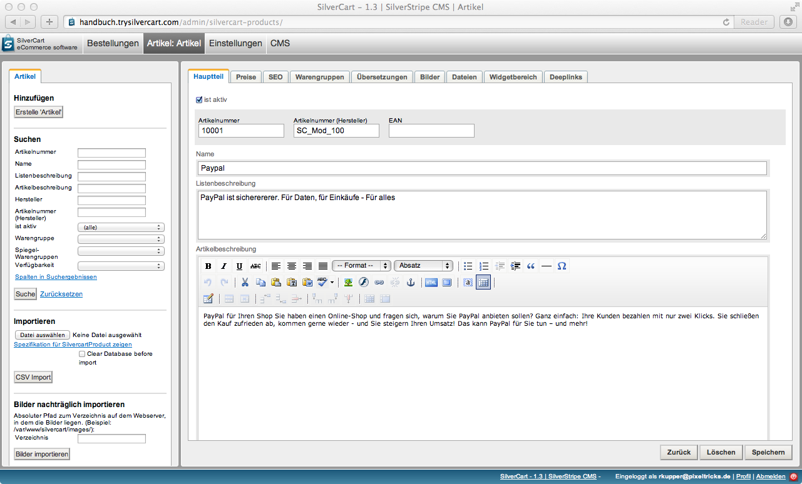

Ist aktiv
Über diese Checkbox steuern Sie, ob ein Artikel grundsätzlich im Front-End angezeigt werden soll oder nicht.

Bestimmte Regeln und Einstellungen (z.B. Lagerbestand) können jedoch dafür sorgen, dass auch aktive Artikel zumindest zeitweise nicht angezeigt werden.

Artikelnummer
Hier können Sie die Artikelnummer des Artikels in Ihrem Sortiment eintragen. Sie können Buchstaben, Zahlen und bestimmte Sonderzeichen wie `-`oder `_` verwenden.

Artikelnummer (Hersteller)
Wenn Ihnen die Artikelnummer des Herstellers bekannt ist und Sie diese im Shop pflegen möchten, dann können Sie dieses Feld dafür nutzen. In manchen Fällen helfen Sie damit Ihren Kunden einen Artikel eindeutig zu identifizieren.

EAN
Die EAN (European Article Number) ist eine europaweit eindeutige Artikelnummer und wird in der Regel als Barcode auf dem Artikel abgebildet. Wenn Ihnen die EAN Ihrer Artikel bekannt sind, dann empfiehlt sich auch die konsequente Pflege der EAN. Dadurch lassen sich Artikel beispielsweise bequem mit einem Handscanner erfassen.

Name
In diesem Feld pflegen Sie den Namen oder die Bezeichnung des Artikels. Bitte verwenden Sie hier kein HTML-Markup.

Listenbeschreibung
Die Listenbeschreibung wird oft auch als Kurzbeschreibung bezeichnet. Sie wird häufig bei der Darstellung von Produkten in einer Listenform (Übersicht der Produkte einer Warengruppe) und zusätzlich für die Meta-Information im Rahmen der Suchmaschinenoptimierung verwendet. Auch hier verwenden Sie bitte kein HTML-Markup.

Artikelbeschreibung
Die Artikelbeschreibung können Sie mit dem WYSIWYG-Editor beliebig aufwendig mit Kursiv- und Fettdruck, Listen und Überschriften gestalten.

Verfügbarkeit

In der Sektion `Verfügbarkeit` können Sie verschiedene Aspekte der Bestandsverwaltung eines Artikels pflegen.

Verfügbarkeit
Über die möglichen Werte der Dropdown-Liste `verfügbar` und `nicht verfügbar` können Sie die grundsätzliche Verfügbarkeit einstellen. 

Min. Bezugsdauer, Max. Bezugsdauer und Einheit (WBZ)
Wenn Sie einen Artikel bei Ihren Lieferanten nachbestellen, dann müssen Sie mit einer bestimmten Lieferzeit rechnen. Diese kann höchst unterschiedlich sein, wird sich meistens jedoch im Bereich von wenigen Tagen befinden. Manche Branchen rechnen hier jedoch in Stunden, andere in Wochen, Monaten oder sogar Jahren. 

Über die 3 Felder `Min. Bezugsdauer`, `Max. Bezugsdauer` und `Einheit (WBZ)` können Sie die übliche Lieferzeit für diesen Artikel hinterlegen.

Möchten Sie Ihren Kunden anzeigen, dass die Lieferzeit eines Artikels ca. 3-5 Tage beträgt, dann würden Sie die folgenden Werte eintragen:

`Min. Bezugsdauer = 3`
`Max. Bezugsdauer = 5`
`Einheit (WBZ) = Tage`

Lagerbestand
Diese Feld zeigt den aktuellen Lagerbestand - also die verfügbare Menge - des Artikels an. Sie können diesen Wert verändern, wenn Sie eine neue Lieferung erhalten.

Ist überbuchbar?
Wenn der Bestand aufgebraucht ist, kann der Artikel in Ihrem SilverCart Webshop nicht mehr bestellt werden.

Unter bestimmten Umständen möchten Sie einen Artikel aber vielleicht auch dann verkaufen, wenn kein Lagerbestand mehr vorhanden ist. Vielleicht befindet sich die Ware im Zulauf oder kann sehr kurzfristig beschafft werden.

Mit der Checkbox `Ist überbuchbar?` können Sie Artikel auch dann zum Verkauf freigeben, wenn eigentlich keine mehr vorhanden sind.

Datum, ab welchem Lagerbestand nicht mehr überbuchbar ist
Hiermit können Sie steuern, dass ein überbuchbarer Artikel nur bis zu einem bestimmten Datum überbuchbar ist. Dies betrifft beispielsweise einen Artikel, der Ihnen zwar innerhalb eines Tages geliefert werden kann, jedoch bei Ihrem Lieferant nur noch bis zu einem bestimmten Datum produziert wird.

Die Bestandsverwaltung in SilverCart

Die Bestandsverwaltung von SilverCart ist sehr umfangreich und kann auch fortgeschrittene Anforderungen abdecken.

Unter `Einstellungen -> Allgemeine Konfiguration -> Lager ->  aktivieren` können Sie die Bestandsverwaltung global ein oder ausschalten.

Mit aktivierter Lagerbestandsverwaltung wird die Menge der jeweiligen Artikel beim Kauf entsprechend der gekauften Menge reduziert. Warenzugänge können direkt in der Artikelpflegemaske in das Textfeld eingetragen werden. Dabei wird stets der gesamte Bestand eingetragen. Um den Bestand korrekt zu erhöhen müssen also Bestand + Zugang addiert und eingetragen werden.

Sollen Artikel verkauft werden auch wenn kein Bestand vorhanden ist, dann aktivieren Sie die Checkbox „Ist der Lagerbestand generell überbuchbar“. Damit werden auch negative Bestandsmengen möglich, beispielsweise für Produkte die sich im Zulauf befinden oder generell sehr kurzfristig geliefert werden können.

Ist diese Option nicht aktiviert, dann können Produkte ohne Bestand nicht mehr verkauft werden. Für Einzelstücke und Restposten kann diese Einstellung direkt am Artikel verändert werden. Wird für einen Artikel eine abweichende Einstellung angegeben, dann hat diese Priorität vor der globalen Einstellung.  

Mit der Einstellung „Ist der Lagerbestand generell überbuchbar“ können Sie Restposten und Einzelstücke sicher verkaufen. Die Shopsoftware sorgt beim Checkout dafür, dass nicht mehr als der tatsächlich verfügbare Bestand verkauft werden kann. Sollten mehrere Kunden das selbe Einzelstück im Warenkorb haben, dann kommt der Kauf mit dem Kunden zustande, der am schnellsten die Bestellung abschliesst. Alle anderen Kunden bekommen die Meldung angezeigt dass der gewünschte Artikel zwischenzeitlich nicht mehr verfügbar ist.

Über die Liste „Verfügbarkeit“ wird lediglich die Anzeige der Verfügbarkeitsinformation bei der Artikeldetailansicht gesteuert. Der hier eingestellte Wert hat keinen Einfluss auf die Bestellbarkeit eines Artikels.

Ob ein Artikel aufgerufen und verkauft werden kann, wird einzig über die Felder „ist aktiv“ und - je nach eingestellter Lagerbestandsverwaltung - über den tatsächlichen Lagerbestand gesteuert.

Sonstiges

Hersteller
Über dieses Dropdown-Feld können Sie dem Artikel einen Hersteller zuweisen. Der Hersteller muss zuvor unter `Artikel -> Hersteller` angelegt werden.

Verkaufsmenge und Verkaufsmengeneinheit
Die übliche Verkaufsmenge ist `1` bei einer Verkaufsmengeneinheit von `Stück`.

Sie können unter `Artikel -> Verkaufsmengeneinheiten` weitere Verkaufsmengeneinheiten wie Flasche, Kiste, Kartusche, Eimer, Fass, Rolle angeben. Damit können Sie im SilverCart Webshop auch aussergewöhnlichen Produktsortimente kundenfreundlich abbilden.

Gewicht
Angabe des Gewichts inkl. Umverpackung in Gramm (ganzzahlig). Das Gewicht kann bei der Berechnung der Versandkosten eine wichtige Rolle spielen.

Artikelzustand
Sie können unter `Artikel -> Artikelzustände` beliebige Artikelzustände wie `neu`, `gebraucht` oder `defekt` definieren. Der Artikelzustand sollte beim Verkauf auf eBay oder Amazon angegeben werden.

#### Preise

Im SilverCart-Webshop haben Sie die Möglichkeit für B2B- und B2C-Kunden jeweils getrennte Preise zu pflegen. Dies ist ein Vorteil, wenn Sie jedem Kunden gerundete („geschönte“) Verkaufspreise anbieten wollen, unabhängig davon ob es sich um einen Brutto- oder einen Nettopreis handelt. Hierfür haben Sie in SilverCart die Möglichkeit, an jedem Artikel einen Preis (Brutto) und einen Preis (Netto) zu hinterlegen.

Der Preis (Brutto) wird dabei mit dem Hinweis „inkl. MwSt“ den Kunden angezeigt, die als B2C-Kunden angelegt sind . Der Preis (Netto) wird analog hierzu mit dem Hinweis „exkl. MwSt“ den Kunden angezeigt, die als B2C-Kunden angelegt sind.

Im Warenkorb und in der Bestellübersicht wird dabei bei B2C-Kunden der Nettopreis aus dem Preis (Brutto) errechnet und bei B2B-Kunden der Bruttopreis aus dem Preis (Netto), falls die Preise gepflegt sind.

Ist nur einer der beiden Preise gepflegt, wird der zugehörige Netto- oder Bruttopreis anhand der am Artikel hinterlegten Mehrwertsteuer berechnet.

Wird keiner der beiden Preise hinterlegt, wird der Artikel aus Sicherheitsgründen in der Webshop-Storefront nicht angezeigt. Handelt es sich tatsächlich um einen kostenlosen Artikel, können Sie das durch anwählen der Option „kostenfreier Artikel“ umgehen.

Preise

Preis (Brutto)
Preis (Netto)
UVP
Einkaufspreis
Steuersatz

#### SEO

SEO steht für `Search Engine Optimization`, auf deutsch bedeutet das `Suchmaschinenoptimierung`.

Ein wichtiger, aber leider oft vernachlässigter Faktor für SEO ist die richtige Nutzung der Meta-Informationen. Es gibt keine vergleichbare Massnahme, die sich so direkt und so offensichtlich bemerkbar macht wie die richtige Pflege der Metadaten. Sie erreichen die Pflegemaske für die Metadaten über den Reiter "SEO".

Hier können Sie den Meta Titel, die Meta-Beschreibung und die Meta-Keywords des Produkts pflegen.

Insbesondere über die Meta-Beschreibung können Sie häufig den Teil bestimmen, den Google bei der Anzeige der Suchergebnisse als Teil des Auszugs einblendet.

Mehr Informationen finden Sie in der Google Webmaster-Tools-Hilfe (Englisch): http://www.google.com/support/webmasters/bin/answer.py?answer=35624

Denken Sie auch immer an ausführliche und hochwertige Produktbeschreibungen und aussagekräftige Bilder. Eine hervorragende Produktbeschreibung bringt gleich doppelten Nutzen: zum einen hilft er bei der besseren Listung Ihres SilverCart Webshops bei Google und anderen Suchmaschinen, zum anderen nutzt die Artikelbeschreibung auch Ihren Besuchern. Und damit steigt die Chance, dass aus einem Besucher auch ein Kunde wird.

#### Warengruppen

Unter einer Warengruppe versteht man im Handel die Zusammenfassung einzelner Artikel anhand eines gemeinsamen Merkmals zu einer Gruppe. Als verbindende Merkmale kommen in Frage:
* Herkunft (z. B. Weine aus Spanien)
* Verwendungszweck (z. B. Getränke)
* Eigenschaften des Herstellungsmaterials (z. B. Holz)
* komplementäre Eigenschaften hinsichtlich eines Verwendungszweckes (z. B. alle Produkte für ein Frühstück)
* Sachbereiche (z. B. bei Büchern eine Warengruppensystematik im Zwischenbuchhandel)

Die Warengruppen können auch weiter in Unterwarengruppen bzw. Artikelgruppen (z. B. alkoholische und alkoholfreie Getränke) differenziert werden oder aber auch in übergeordneten Warenarten zusammengefasst werden (z. B. Food und Nonfood). Auch ist eine verschmelzende Zuordnung einzelner Warengruppen zu ebenfalls übergeordneten Hauptwarengruppen üblich: So werden vielfach die inhaltlich verwandten Warengruppen Glas, Porzellan, Keramik zur Hauptwarengruppe GPK (oder vergleichbar: Papier-, Büro- und Schreibwaren zu PBS) zusammengefasst. Die Gesamtheit aller geführten Artikel eines Handelsgeschäftes bezeichnet man dagegen als Sortiment.
Zuordnung zu Warengruppen

Grundsätzlich gehört ein Artikel zu genau einer Warengruppe. Diese Warengruppe ist die Stammgrupe des Artikels. Viele Warenwirtschaftssysteme arbeiten ebenfalls nach diesem Prinzip. Dadurch ist es einfach, Artikel aus verschiedenen Warenwirtschaftssystemen zu importieren. Die Zuordnung zu einer Warengruppe erfolgt über den Reiter "Links" und dann "Warengruppe". Hier können Sie einem Artikel genau eine Warengruppe als Stammgruppe zuordnen.

Quelle: wikipedia (http://de.wikipedia.org/wiki/Warengruppe)

Zuordnung zu Spiegel-Warengruppen

Nicht immer lässt sich ein Produktsortiment so geradlinig durch eine Zuordnung von einem Produkt zu genau einer Warengruppe abbilden. Es gibt gute Gründe, dass ein Produkt in mehreren Warengruppen oder auch Kategorien vertreten sein kann.

Über die Zuordnung zu Spiegel-Warengruppen können Sie jedes Produkt zusätzlich zu seiner Stammgruppe beliebig vielen weiteren Warengruppen zuordnen. Über den Reiter "Spiegel-Warengruppen" erreichen Sie die Zuordnungsmaske. Setzen Sie ein Häkchen neben einer Warengruppe wenn der Artikel dieser Warengruppe zusätzlich zu seiner Stammgruppe zugeordnet werden soll. Der Artikel wird dann in diese Warengruppe "gespiegelt". Ebenso wie bei einem Spiegelbild wirken sich Veränderungen am Original direkt auf das Spiegelbild aus. Dadurch wird deutlich, dass wir keine Kopie des Artikels angelegt haben, sondern immer nur mit dem Original arbeiten. Eine Änderung am Artikel wirkt sich somit unmittelbar auf den Artikel aus, auch wenn er in eine Warengruppe gespiegelt wurde.

Anwendungsbeispiel: Spiegel-Warengruppen für Preisportal-Exporte

Ein Anwendungsfall für Spiegel-Warengruppen ist die Aufteilung des Sortiments für verschiedene Preisportale. Für den Fall, dass Sie nur bestimmte Teile Ihres Sortiments auf einem Preisportal anbieten möchten, können Sie alle gewünschten Produkte einer eigens hierfür angelegte Spiegel-Warengruppe zuordnen. In der Konfiguration des Exports können Sie dann angeben, dass nur Artikel dieser Spiegel-Warengruppe verwendet werden sollen.

#### Übersetzungen

Für einen mehrsprachigen Webshop können Sie hier die Übersetzungen des Artikels pflegen. SilverCart ist vollständig auf UTF-8 aufgebaut und erlaubt dadurch auch die Übersetzung in andere Zeichensätze wie beispielsweise kyrillisch.

Über `Übersetzung hinzufügen` können Sie eine neue Sprache eintragen. Eine bestehende Übersetzung können Sie mit dem Notizblock-Symbol bearbeiten. Es stehen Ihnen die folgenden Felder für Übersetzungen zur Verfügung:

	•	Name
	•	Listenbeschreibung
	•	Artikelbeschreibung
	•	Meta-Beschreibung für Suchmaschinen
	•	Meta-Schlagworte für Suchmaschinen
	•	Meta-Titel für Suchmaschinen

#### Bilder

SilverCart ermöglicht Ihnen die Zuordnung mehrerer Bilder zu einem Artikel. Da Produktbilder durchaus auch sprachabhängig sein können (denken Sie an Verpackungen in anderen Sprachen), können Sie zudem eigene Bilder für verschiedene Sprachen hinterlegen.

Sie öffnen die Bildverwaltung über den Reiter `Bilder`. Bereits vorhandene Bilder werden in einer übersichtlichen Tabelle dargestellt.

Ein neues Bild können Sie über `Bild hinzufügen` anlegen. Es öffnet sich ein Fenster, bei dem Sie ein neues Bild hochladen oder ein bereits hochgeladenes Bild auswählen können. Wählen Sie `Bild anhängen` um das Bild dem Artikel zuzuordnen.

Die Angabe der `Sortierreihenfolge` bestimmt die Reihenfolge wenn mehrere Artikelbilder hinterlegt sind.

Über den Reiter `Übersetzungen` können Sie das Bild für eine andere Sprache anlegen.

Vergessen Sie nicht, Ihre Änderungen mit `Speichern` zu bestätigen.

Mit dem roten `X` können Sie ein Bild löschen. Bestätigen Sie hierfür die Sicherheitsabfrage mit `OK`

#### Dateien

Neben Bildern können Sie dem Artikel auch Dateien zuordnen. Ein häufiger Anwendungsfall sind Bedienungsanleitungen oder die Packungsbeilage bei Medikamenten. Sie können hier aber auch Treiber oder ergänzende Programmdateien anbieten.

Wählen Sie hierfür `Datei hinzufügen` und wählen Sie eine Datei von Ihrem Computer oder eine bereits hochgeladene Datei aus. Mit `Datei anhängen` weisen Sie die Datei zu. Sie können einen Namen und eine Beschreibung angeben um Ihren Kunden den Inhalt der Datei zu beschreiben.

Soll in anderen Sprachen eine andere Datei, ein anderer Name oder eine andere Beschreibung verwendet werden, dann können Sie hierfür über den Reiter `Übersetzungen` eine Übersetzung anlegen.

Am Ende können Sie Ihre Änderungen `speichern`.

## Hersteller

Einem Artikel können Sie genau einen Hersteller zuordnen. Darüber lassen sich dann alle Artikel eines bestimmten Herstellers im Shop gruppieren. 

Zudem können Sie Ihren Kunden weiterführende Informationen zum dem Hersteller anbieten.	

### Hauptteil

Zu jedem Hersteller können Sie einen `Titel` (der Name) und eine `URL` (Link zur Homepage des Herstellers) pflegen. 

Ergänzend können Sie noch ein Logo als Bild anhängen. 

### Artikel

Der Reiter `Artikel` zeigt alle Produkte, die mit diesem Hersteller verknüpft sind. Wenn Sie einen Hersteller neu anlegen, dann wird dieser Reiter erst nach dem Speichern sichtbar.

### Übersetzungen

Hier können Sie eine sprachabhängige Übersetzung zu der Herstellerbeschreibung speichern.

Titel und das Logo sind in der Regel sprachunabhängig, deshalb können Sie für diese Angaben keine Übersetzung hinterlegen.

## Verfügbarkeit

Sie können Ihren Artikeln im SilverCart Webshop beliebige Verfügbarkeiten anlegen.

Zur Standardinstallation gehören zwei Verfügbarkeitsstatus: "Verfügbar" und "nicht verfügbar". 

### Hauptteil

Verfügbarkeit
Hier tragen Sie den Text ein, den der Verfügbarkeitsstatus haben soll.

Zusatztext
Bei Bedarf können Sie hier eine weitere Beschreibung des Verfügbarkeitsstatus eintragen.

Code
Der Code ist nur für Programmierer von Interesse und sollte nicht verändert werden. Wenn Sie einen neuen Verfügbarkeitsstatus anlegen, können Sie auf den Code verzichten.

### Übersetzungen

Im Tab `Übersetzungen` können Sie die Verfügbarkeitsstatus in andere Sprachen übersetzen.

Mit `Übersetzung hinzufügen` legen Sie eine neue Übersetzung an. Dabei können Sie je Sprache den Text für `Verfügbarkeit` und für den `Zusatztext` eintragen.

Bestehende Übersetzungen können Sie über den Notizblock bearbeiten oder löschen.

## Mengeneinheiten

Sie haben die Mengeneinheiten bereits im Hauptteil der Artikeldetailansicht kennen gelernt.

Mit den Mengeneinheiten können Sie auch Produktsortimente jenseits von `Stück` kundenfreundlich beschreiben. Wenn Sie Ihre Waren in Flaschen, Kisten, Beuteln, Fässern, Ampullen, Dosen oder Ballen anbieten, können Sie diese Einheiten hier anlegen.

### Hauptteil

Im Hauptteil können Sie 3 Werte je Verkaufsmengeneinheit pflegen:

* Anzahl Dezimalstellen
* Name
* Abkürzung

`Anzahl Dezimalstellen` gibt an, in welchen Mengen das Produkt gekauft werden kann. Sind nur ganzzahlige Mengen möglich, tragen Sie `0` ein oder lassen das Feld leer.

Sind auch andere Werte möglich (z.B. 1,5 Meter Stoff), dann geben Sie die Anzahl der gewünschten Nachkommastellen an.

`Name` ist die Bezeichnung der Verkaufsmengeneinheit. Beispiel: Flasche.

Unter `Abkürzung` tragen Sie die geläufige Abkürzung ein. Im Beispiel der Flasche wäre das `Fl.`.

### Übersetzungen

Im Tab `Übersetzungen` können Sie die Verkaufsmengeneinheiten in andere Sprachen übersetzen.

Mit `Übersetzung hinzufügen` legen Sie eine neue Übersetzung an. Dabei können Sie je Sprache den Text für `Name` und für die `Abkürzung` eintragen.

Bestehende Übersetzungen können Sie über den Notizblock bearbeiten oder löschen.

## Steuersätze

In der Standardinstallation gib es zwei Steuersätze: 7% und 19%.

Weitere Steuersätze können Sie bei Bedarf selbst anlegen.

### Hauptteil

Steuersatz in %
Wird zur Berechnung benutzt und muss eine Zahl sein. Soll ein Steuersatz mit Nachkommastellen angelegt werden, dann muss hierfür ein Dezimalpunkt verwendet werden, also „14.5“

Bezeichner
Wird zur Darstellung des Steuersatzes im Front-End benutzt

Ist Standard
Mit dieser Checkbox wird der Steuersatz als Standard für neu angelegte Artikel bestimmt. 

### Artikel

Unter dem Reiter "Artikel" werden alle Artikel gezeigt, die diesen Steuersatz haben. Der Reiter wird erst sichtbar, nachdem der Steuersatz angelegt und erfolgreich gespeichert wurde. 

### Übersetzungen

Unter dem Reiter „Übersetzungen“ können Sie die Übersetzungstexte für das Feld „Bezeichner“ in den gewünschten Sprachen hinterlegen.

## Artikelzustände

Bestimmte Marktplätze, wie z.B. Amazon oder ebay erfordern die korrekte Pflege des Artikelzustands. Dies ist notwendig, da auf diesen Marktplätzen neben Neuware auch gebrauchte Artikel mit konkreten Zustandsangaben angeboten werden.

Dem Artikelzustand können deshalb Werte wie "gebraucht", "neu" oder "neuwertig" hinterlegt werden. Ein Artikelzustand hat nur ein einziges pflegbares Feld. 

Unter dem Reiter "Artikel" (wird erst nach dem Hinzufügen des Zustandes angezeigt) werden alle Artikel angezeigt, die diesen Zustand besitzen. Der Artikelzustand kann am Artikel dann unter "Hauptteil->Inhalt" per Dropdown gepflegt werden.

## Artikelmerkmale

# Tab Abwicklung

## Zahlarten

Die hier angezeigten Zahlarten entsprechen den installierten Zahlungsmodulen. In diesem Fall sind die Module iPayment, Paypal und Vorkasse installiert. Die Zahlart "Rechnung" ist schon ohne installierte Zahlungsmodule verfügbar.

Alle Zahlungsmodule haben gemeinsame Konfigurationsoptionen, die im Folgenden aufgeführt sind.

Grundeinstellungen

aktiviert
Mit dieser Option lässt sich jede Zahlart komfortabel ein- und ausschalten.

Mindestbetrag für Modul
Der Bestellwert muss zur Zulassung dieser Zahlart erreicht werden.

Höchstbetrag für Modul
Der Bestellwert darf diesen Betrag nicht überschreiten, sonst ist die Zahlart nicht mehr verfügbar.

Name
Ein frei konfigurierbarer Name, der dem Kunden im Checkout als Name der Zahlart angezeigt wird.

Beschreibung
Die Beschreibung der Zahlart wird dem Kunden im Checkout angezeigt. Sie dient der Erläuterung der Zahlart.

Modus
Die Zahlart kann im Entwicklungsmodus getestet werden (dev) oder für den Livebetrieb freigeschaltet werden (live).

Standard Bestellstatus für diese Zahlart
Bestellungen bekommen diesen Status, wenn sie mit dieser Zahlart abgeschlossen werden.

Logos

Zahlarten können Logos haben, die im Checkout angezeigt werden. Dazu müssen Sie die Checkbox "Logos anzeigen" setzen.

Zugriffsverwaltung

Die Verfügbarkeit der Zahlart kann an verschiedenen Bedingungen geknüpft werden. So kann eine Mindestanzahl von Bestellungen definiert werden, die ein Kunde abgeschlossen haben muss, bevor er die Zahlart nutzen kann. Dazu muss die Checkbox "die folgende Regel anwenden" gesetzt sein. Außerdem kann unter dem Reiter "Gruppen" die Zahlart für bestimmte Gruppen aktiviert oder ausdrücklich deaktiviert werden. Unter dem Reiter "Kunden" können Sie eine Zahlart sogar für einzelne Kunden aktivieren und deaktivieren.
1-2  Stichwörter bearbeiten

## Versandarten

Wenn Sie die Beispielkonfiguration angelegt haben, dann existiert bereits die Versandart "Paket". Andernfalls können Sie eine Versandart erstellen, indem Sie auf die Schaltfläche "Erstelle 'Versandart'" klicken. Ein Versandart hat immer einen Namen, und muss einem Frachtführer zugeordnet sein. Unter dem Reiter "Versandgebühren" (Erst sichtbar nach dem Hinzufügen) werden alle Versandgebühren gezeigt, die zu dieser Versandart gehören. Der Reiter "Zonen" zeigt alle Zonen, die gepflegt wurden. Die Zonen werden per Checkbox dieser Versandart zugeordnet. Eine Versandart kann mehreren Zonen zugeordnet werden.

## Zonen

Frachtführer wie zum Beispiel DHL und UPS gruppieren Länder oft in Zonen. So müssen Versandarten nicht für jedes Land einzeln definiert werden, sondern für eine Zone, die mehrere Länder beinhaltet. Eine Zone gehört immer zu einem Frachtführer. Selbst wenn zwei Frachtführer identische Zonen benutzen, müssen Sie die Zone für jeden Frachtführer neu anlegen.

## Länder

SilverCart hat in seiner Grundinstallation schon alle Länder angelegt. Bitte aktivieren Sie jedes Land, in das Sie Ihre Ware versenden wollen.
Weitere Angaben müssen Sie hier nicht machen. 

Bitte beachten Sie, dass neu hinzugefügte Länder nicht automatisch den verfügbaren Zahlarten und Zonen zugewiesen wurden. Sie können das betreffende Land wie folgt einer Zahlart zuweisen:
Die Detailansicht eines Landes zeigt einen Reiter "Zahlart". Hier werden alle existierenden Zahlkarten aufgeführt. Falls Sie eine Zahlart für ein Land aktivieren möchten, setzen Sie bitte das Häkchen in der ersten Spalte. Im Bild sind global die Zahlarten "Rechnung" und "Vorkasse" aktiviert (Spalte "aktiviert"), für das aktuell bearbeitete Land allerdings nur die Zahlart "Vorkasse".

Um ein Land einer Zone zuzuordnen, nutzen Sie den Menüpunkt „Zonen“.

## Frachtführer

Wenn Sie die Beispieldaten konfiguriert haben, dann besitzen Sie bereits den Frachtführer DHL. Einen neuen Frachtführer können Sie über die linke Schaltfläche "Erstelle 'Frachtführer" erstellen. Im Reiter Versandarten (Erst nach Hinzufügen des Frachtführers sichtbar) werden die zum Frachtführer gehörenden Versandarten angezeigt. Sollten Sie hier neue Versandarten anlegen, werden diese automatisch dem Frachtführer zugeordnet. Das gleiche gilt für die Zonen.

# Tab Kunden

## Kunden

Im Auslieferungszustand gibt es in SilverCart vier verschiedene Kundenklassen: 

* Endkunden
* anonyme Kunden
* Geschäftskunden
* Administratoren

Für jede Kundenklasse kann festgelegt werden, ob die Produktpreise brutto (inklusive Mehrwertsteuer) oder netto (exklusive Mehrwertsteuer) angezeigt werden. Öffnen Sie dazu das Konfigurationsobjekt (siehe Allgemeine Konfiguration): 

Im Reiter "Preise" können Sie unter "Preistypen" die entsprechenden Einstellungen vornehmen.
Außerdem können Bezahl- und Versandarten auf Kundenklassen beschränkt werden.

Endkunde

Ein Kunde, der sich über das Registrierungsformular von SilverCart anmeldet, ist ein Endkunde. 

Anonyme Kunden

Anonyme Kunden sind alle Kunden, die einen Warenkorb befüllen/anlegen. Durch diesen Mechanismus ist es möglich den Bestellprozess ohne anlegen eines Kundenkontos abzuschließen. Besitzt ein anonymer Kunde einen Warenkorb und registriert sich während des Bestellprozesses wird der Warenkorb auf den neu angelegten Kunden übernommen und der Prozess kann somit ohne weitere Verzögerung abgeschlossen werden.

Geschäftskunden

Um zu einem Geschäftskunden zu werden, muss ein registrierter Kunde von einem Administrator in dem Bereich "Sicherheit" in eine Geschäftskundengruppe verschoben werden. SilverCart übernimmt den Rest für Sie und stellt, je nach Konfiguration, alle Preise auf Nettopreise um. Außerdem wird nun ausdrücklich der Hinweis `exkl. MwSt.` an allen Artikelpreisen angezeigt.

### Kunden suchen

Zur Verwaltung der Kunden in Ihrem SilverCart-Webshop stehen Ihnen umfangreiche Filter zur Verfügung.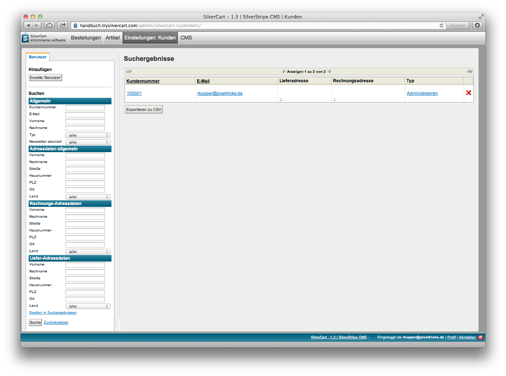
Allgemeine Daten

* Kundennummer
* E-Mail
* Vorname
* Nachname
* Typ
* Newsletter abonniert

Adressdaten allgemein
* Vorname
* Nachname
* Straße
* Hausnummer
* PLZ
* Ort
* Land

Rechnungsadresse
* Vorname
* Nachname
* Straße
* Hausnummer
* PLZ
* Ort
* Land

Lieferadresse
* Vorname
* Nachname
* Straße
* Hausnummer
* PLZ
* Ort
* Land

### Kunden-Detailansicht

Sie gelangen zur Kunden-Detailansicht indem Sie einen Kundeneintrag aus der Übersicht auswählen (anklicken).

In der Detailansicht finden Sie alle bekannten Informationen über den Kunden sowie alle verknüpften Bestellungen und Adressen.

## Kontaktanfragen

SilverCart verfügt über eine Kontaktformularseite, die in einer Standardinstallation automatisch angelegt wird. Über das Kontaktformular kann jeder Besucher der Seite eine Nachricht an den Shopbetreiber schicken. Dabei hinterlässt er eine E-Mail-Adresse, Vor- und Nachnamen und eine Nachricht. Der Shopbetreiber bekommt zum einen eine Kontakt-E-Mail an die Adresse, die er in der Konfiguration hinterlegt hat. Zum anderen wird jede Kontaktanfrage noch einmal im System gespeichert. 

Die Übersicht zeigt das Datum und die Uhrzeit, den Namen und die E-Mail-Adresse der Anfrage.

## Sicherheit

Hinter dem Menüpunkt "Sicherheit" steckt die Benutzerverwaltung von SilverCart. Hier werden alle registrierten Benutzer nach Benutzergruppen sortiert angezeigt. 

In der Baumstruktur auf der linken Seite werden die Benutzergruppen angezeigt. Wenn Sie die Wurzel "Sicherheitsgruppen" anwählen, werden alle registrierten/angelegten Benutzer angezeigt. Wenn Sie hier einen Benutzer löschen, dann wird er vollständig aus dem System gelöscht. Befinden Sie sich hingegen in einer Gruppe beim Löschen eines Nutzers, so wird er nur aus der Gruppe entfernt.

Mitglieder in der Gruppe "Administratoren" haben vollen Zugriff auf das Back-End. "Inhaltsautoren" können die Bereiche "Sicherheit" "Silvercart Administration" und "Silvercart Konfiguration" nicht betreten.

Sollte ein Besucher ohne Anmeldung etwas in den Warenkorb legen, so wird ein "Anonymer Kunde" erzeugt und automatisch eingeloggt. Der Warenkorb des anonymen Kunden bleibt dann einige Tage bestehen, sollte er sich nicht zu Checkout begeben. Registriert sich ein Nutzer während des Bestellprozesses, dann wird ein Endkunde erzeugt und der Warenkorb auf diesen Endkunden übertragen. Das gleiche passiert mit einem Kunden, der etwas in den Warenkorb legt und sich dann erst einloggt.

----

# Tab Einstellungen

## Einstellungen

### Hauptteil

Pflegen Sie im ersten Feld "E-Mail Absender" die E-Mail-Adresse, die bei allen E-Mails des Shops als Absender angegeben werden soll. Sie müssen immer eine Absender Adresse angeben, da einige Mailserver Mails ohne Absender als SPAM betrachten und die E-Mail nicht annehmen. Sie werden bei der Erstinstallation aufgefordert, diese Emailadresse einzupflegen.

Das zweite Feld "Globaler E-Mail Empfänger" ist kein Pflichtfeld. Sie können hier eine E-Mail-Adresse angeben, an die eine Kopie aller von SilverCart versendeten E-Mails geht. Bitte beachten Sie, dass Ihr Postfach dadurch erheblich belastet werden kann und dass viele E-Mails unter Umständen doppelt an Sie versendet werden.

Über die Checkbox "Geburtsdatum bei Registrierung abfragen?" können Sie bestimmen, ob das Geburtsdatum bei der Registrierung angegeben werden muss.

Im folgenden Dropdown definieren Sie einen standard Artikelzustand, zB neu, gebraucht, generalüberholt, etc. Bitte beachten Sie, dass Sie unter Silvercart Konfiguration-> Artikelzustand zuerst Artikelzustände anlegen müssen, bevor das Dropdown-Feld Werte anzeigt.

### Zugriff

### SEO

Google Webmaster Tools Code
Google Webmaster Tools ist ein kostenloser Service von Google. 

Über die Google Webmaster Tools erhalten Sie man Informationen über die Ihren Webshop, die nicht öffentlich verfügbar sein sollen. So sehen Sie dort unter anderem, welche Websites auf Ihre Domain verlinken, zu welchen Suchbegriffen die Ihre Domain in der Google-Suche gefunden wird und ob sowie welche Probleme beim Crawling festgestellt wurden.

Darüber hinaus dienen die Google Webmaster Tools als Kommunikationskanal zwischen Ihnen und Google. Sofern es Probleme mit Ihrer Website gibt, beispielsweise eine Infektion der Domain mit Malware, erhalten Sie eine Benachrichtigung. 

Um Zugriff auf die in Google Webmaster Tools bereitgestellten Informationen zu einer Domain erhalten, müssen Sie die Inhaberschaft der Domain bestätigen. Um die Inhaberschaft zu bestätigen, kopieren Sie den Google Webmaster Tools Code in das Textfeld und speichern Sie die Änderung.

Der Google Webmaster Tools Code kann nun von Google ausgelesen werden.

Google Analytics Tracking Code
Google Analytics ist ein Dienst von Google mit dem Sie den Datenverkehr Ihrer Website analysieren können. Dabei werden unter anderem die Herkunft der Besucher, die Verweildauer sowie die Nutzung durch Suchmachinen analysiert.
Wenn Sie Google Analytics nutzen möchten, tragen Sie den Tracking Code in das Textfeld ein und speichern Sie die Änderung.

Da die Informationen bei Google und damit ausserhalb der eigenen Kontrolle gespeichert werden, sehen viele Datenschützer den Dienst als problematisch an. Eine Alternative hierzu ist die Analysesoftware piwik.

Google Conversion Tracking Code
Im Rahmen von Google Analytics können Sie die Conversionsrate im E-Commerce messen. Hierzu benötigt Google Informationen über erfolgreiche Kaufabschlüsse. Diese werden über den Google Conversion Tracking Code an Google übermittelt.

Kopieren Sie den Google Conversion Tracking Code in das Textfeld ein und speichern Sie die Änderung.

Piwik Tracking Code
Piwik ist ein Open-Source-Programm für Webanalytic und eine echte Alternative zu Google Analytics. Piwik hat den Vorteil, dass die erhobenen Daten nicht bei einem Fremdanbieter gespeichert werden.

Wenn Sie Piwik nutzen möchten, tragen Sie den Piwik Tracking Code in das Textfeld ein und vergessen Sie nicht die Änderung zu speichern.

### SocialMedia

Facebook Link

Twitter Link

Xing Link

### Übersetzungen

### Formular Konfiguration

Anzahl der Zeichen im Captcha

Breite in Pixel

Höhe in Pixel

JPG Qualität des Captcha-Bilds (0 [schlechteste] bis 100 [beste])

## Einstellungen Shop

Die allgemeinen Konfigurationsoptionen der SilverCart Shopsoftware sind übersichtlich in verschiedene Menüpunkte einsortiert.

Wahrscheinlich werden Sie die Einstellungen einmalig bei der Einrichtung Ihres SilverCart Webshops vornehmen und danach nur noch in seltenen Fällen nachträglich etwas anpassen.

### Hauptteil

#### Grund-Einstellungen

Standardsprache
Mit diesem Dropdown können Sie die Standardsprache Ihres Online-Shops einstellen. 
Wenn Sie Ihren Online-Shop in mehreren Sprachen betreiben wollen, dann ist ein Wechsel in eine andere Sprache für den Besucher über die Sprachauswahl im Frontend möglich. Über die Standardsprache wird festgelegt, welche Sprache voreingestellt ist.

Standardsprache benutzen, wenn die passende Sprache fehlt
Für den Fall, dass keine passende Sprache gefunden werden kann, kann die gewählte Standardsprache als Notlösung verwendet werden. Aktivieren Sie hierfür die Checkbox.

Standard Währung
Die Standardwährung muss im ISO 4217 Format eingegeben werden. Jede Währung ist immer eine Kombination aus drei Buchstaben, zum Beispiel EUR, CHF, GBP oder USD.

Standard Preistyp
Der Standard Preistyp bestimmt in welcher Form die Preise im Shop angezeigt werden, wenn eine Zuordnung zu Kundengruppen nicht möglich ist. Dieser Fall tritt beispielsweise dann ein, wenn ein Besucher nicht eingeloggt ist oder kundengruppenspezifische Preise nicht gewünscht sind.

Bei der Einstellung brutto werden die Preise inklusive der am Artikel hinterlegten Mehrwertsteuer angezeigt. Dies ist dann sinnvoll, wenn sich Ihr Angebot hauptsächlich an Endverbraucher (B2C) richtet.

Mit der Einstellung netto werden die Preise für Wiederverkäufer oder Geschäftskunden zuzüglich der Mehrwertsteuer angezeigt. 

Achtung Abmahngefahr: wenn Sie mit Nettopreisen werben müssen Sie dafür Sorge tragen, dass sich dieses Angebot ausschliesslich an Letztverbraucher in ihrer selbständigen beruflichen oder gewerblichen oder in ihrer behördlichen oder dienstlichen Tätigkeit richtet.

#### E-Mail-Einstellungen

E-Mail Absender
Der E-Mail Absender wird als Absenderadresse aller E-Mails verwendet, die von SilverCart gesendet werden.

Globaler E-Mail Empfänger
Sie können den einen globalen E-Mail Empfänger optionalhinterlegen. An diese E-Mail-Adresse werden alle vom Shop erzeugten E-Mails (Bestellbestätigungen, Kontaktanfragen, etc.) gesendet. 

Die bei den E-Mail-Templates gesetzten Empfängeradressen bleiben davon unberührt. Diese werden nicht ersetzt, sondern nur ergänzt.

Standard E-Mail-Empfänger
E-Mails, die für den Shop-Betreiber bestimmt sind, werden an die hier hinterlegte Adresse gesendet.

Standard E-Mail-Empfänger für Auftragsbenachrichtigungen
Auftragsbenachrichtigungen werden nicht mehr an den Standard E-Mail-Empfänger, sondern an die hier hinterlegte Adresse gesendet. Hier können Sie die E-Mail-Adresse eines bestimmten Sachbearbeiters der für die Bearbeitung von Bestellung zuständig ist hinterlegen.

Standard E-Mail-Empfänger für Kontaktanfragen
Kontaktanfragen werden nicht mehr an den Standard E-Mail-Empfänger, sondern an die hier hinterlegte Adresse gesendet. Nutzen Sie diese Funktion, wenn ein bestimmter Mitarbeiter für die Bearbeitung von Kundenanfragen zuständig ist.

Eine Mitarbeiterübergreifende Bearbeitung von Anfragen ist mit unserem optional erhältlichen SilverCart Ticket-System möglich.

#### Kunden-Einstellungen

Geschäftskunden erlauben
Wenn Sie diese Option aktiviert haben, können sich neue Kunden bei der Registrierung als Geschäftskunden registrieren. Hierbei ist in der Regel eine individuelle Nachprüfung der Gewerbeanmeldung oder des Handelsregistereintrags notwendig.

Adresseingabefelder für PACKSTATION aktivieren
Aktivieren Sie diese Checkbox, wenn Sie die Zustellung an eine Packstation zulassen möchten.

Geburtsdatum bei Registrierung abfragen?
Diese Checkbox aktiviert die Abfrage des Geburtsdatums bei der Registrierung. Für eine Bestellabwicklung nach FSK18 reicht dies alleine jedoch nicht aus. 

#### Artikel-Einstellungen

Lagerbestandsverwaltung aktivieren
Ist die Lagerbestandsverwaltung aktiviert, also die Checkbox `Lagerbestandsverwaltung aktivieren` ausgewählt, kann ein Artikel nur in den Warenkorb gelegt werden, wenn sein Lagerbestand größer null ist. Ein Kunde kann von einem Artikel dann auch nur die verfügbare Anzahl in den Warenkorb legen.

Ist der Lagerbestand generell überbuchbar?
Ist ein Lagerbestand überbuchbar (gesteuert über die Checkbox `Ist der Lagerbestand generell überbuchbar?`), dann kann ein Artikel immer in den Warenkorb gelegt werden. Der Lagerbestand des Artikels wird dann trotzdem weitergezählt und kann somit auch negativ werden.

Artikel pro Seite
Anzahl der Artikel, die in einer Warengruppe angezeigt werden bevor paginiert wird.

Warengruppen pro Seite
Anzahl der Warengruppen, die in einer Warengruppenübersicht gezeigt werden; Darüber hinaus wird paginiert.

Anzahl gleichzeitig angezeigter Seitenzahlen
Über diesen Wert können Sie einstellen, wie viele Seitenzahlen gleichzeitig angezeigt werden wenn die Anzeige über mehrere Seiten erfolgt.

Standard Artikelbild
Dieses Bild wird angezeigt, wenn an einem Artikel gar keine Bilder gepflegt sind.

Strengere Suche verwenden
Je nach Sortiment kann es sinnvoll sein, die Suche strenger durchzuführen. Dadurch wird das Suchergebnis zwar besser, aber unter Umständen zu stark eingeschränkt. Bei großen Artikelmengen ist eine strenge Suche in der Regel schneller und blockiert weniger Systemressourcen.

Vorgabe-Zustand
Der hier hinterlegte Vorgabe-Zustand wird verwendet, wenn nichts anderes am Artikel definiert ist.

#### Warenkorb- & Checkout-Einstellungen

SSL verwenden
Der Checkout Prozess kann über eine SSL Verbindung laufen. Dazu benötigt die Seite aber noch ein entsprechendes Zertifikat. Aktivieren Sie diese Option, wenn Sie ein gültiges SSL-Zertifikat installiert haben und SSL in Ihrem Webshop verwenden möchten. 

Kunde zum Warenkorb umleiten nach Aktion "In den Warenkorb legen"
Nachdem der Kunde ein Produkt in den Warenkorb gelegt hat, können Sie den Kunden direkt zum Warenkorb umleiten indem Sie diese Option aktivieren. Ist die Option nicht aktiviert, verbleibt der Kunde auf der aktuellen Seite, nachdem er ein Produkt in den Warenkorb gelegt hat.

Sofort zum Checkout umleiten, wenn Kunde den Warenkorb betritt.
Der Kunde kann automatisch zur Warenkorbseite geleitet werden nachdem er etwas in den Warenkorb gelegt hat. Diese Option bewirkt, dass direkt der Checkout-Prozess eingeleitet wird anstatt den Warenkorb anzuzeigen.

Artikelbeschreibung in Warenkorb anzeigen
Mit dieser Option können Sie einstellen, ob eine weiterführende Artikelbeschreibung eines Produkts im Warenkorb bei der Anzeige des Produkts dargestellt wird. In der folgenden Option Feld für Artikelbeschreibung im Warenkorb können Sie auswählen, welcher Feldinhalt hierfür benutzt wird.

Feld für Artikelbeschreibung im Warenkorb
Diese Auswahl wirkt in Verbindung mit der Option Artikelbeschreibung in Warenkorb anzeigen. Hier können Sie auswählen, ob die Artikelbeschreibung oder die Listenbeschreibung am jeweiligen Artikel in der Warenkorbansicht dargestellt wird. Da die Artikelbeschreibung einen sehr langen HTML-Text und auch Bilder enthalten kann, sollte diese Entscheidung sorgfältig geplant werden. 

Empfehlenswert ist die Pflege einer optimierten Listenbeschreibung, da diese auch an anderer Stelle sinnvoll verwendet werden kann.

Maximal erlaubte Anzahl eines Artikels im Warenkorb
Hier können Sie die gewünschte Menge eintragen, wenn Sie die Anzahl eines Artikels den ein Kunde pro Kaufvorgang erwerben kann beschränken wollen. Dadurch wird Anzahl der kaufbaren Produkte auf den hinterlegten Wert begrenzt. Dies kann prinzipiell jedoch umgangen werden, indem der Kunde mehrere Kaufabschlüsse tätigt.

Mindestbestellwert aktivieren
Es kann für den Checkout ein Mindestbestellwert definiert werden. Mit dieser Option können Sie einstellen, ob ein Mindestbestellwert erreicht werden muss, bevor die Bestellung ausgelöst werden kann. Ist dieser Mindestbestellwert nicht erreicht, kann der Kunde nicht zur Kasse gehen.

Mindestbestellwert
In Verbindung mit der Option Mindestbestellwert aktivieren können Sie hier den gewünschten Betrag eingeben, den der Warenkorb mindestens erreichen muss um eine Bestellung zu ermöglichen.
Die angezeigte Währung entspricht der hinterlegen Standard Währung und wird automatisch geändert, sobald sich die Standard Währung ändert.
 
Einstellungen zur Versandkostenfreiheit benutzen
Wenn Sie ab einem Bestimmten Betrag versandkostenfrei versenden möchten, dann aktivieren Sie diese Option. 

Versandkostenfrei ab
In diesem Feld können Sie den konkreten Betrag einstellen, aber dem Bestellungen versandkostenfrei versendet werden. Beachten Sie, dass hierfür zusätzlich die Option Einstellungen zur Versandkostenfreiheit benutzen aktiviert sein muss.

Auswahl der Versandart überspringen, wenn nur eine auswählbar ist.
Im Checkout-Prozess gibt es einen eigenen Schritt zur Auswahl der Versandart. Wenn nur eine Versandart möglich ist, kann dieser Schritt übersprungen werden, da der Kunde auf der Seite keine Auswahl treffen kann. Aktivieren Sie hierfür diese Option um den Bestellschritt der Versandartauswahl zu überspringen.

Auswahl der Zahlungsart überspringen, wenn nur eine auswählbar ist.
Im Checkout-Prozess gibt es einen eigenen Schritt zur Auswahl der Zahlungsart. Wenn nur eine Zahlungsart möglich ist, kann dieser Schritt übersprungen werden, da der Kunde auf der Seite keine Auswahl treffen kann. Aktivieren Sie hierfür diese Option um den Bestellschritt der Zahlungsartauswahl zu überspringen.

Gewichte in Kilogramm (kg) anzeigen
Gewichte werden in SilverCart intern in Gramm verarbeitet. Abhängig von Sortiment kann es sinnvoll sein, die Gewichte in Kilogramm anzuzeigen. Aktivieren Sie diese Option, wenn Gewichte in Kilogramm und nicht in Gramm angezeigt werden sollen.

Hinweis für zusätzliche Gebühren ins Nicht-EU Ausland anzeigen.
Durch Aktivierung dieser Option wird in der Bestellzusammenfassung ein Hinweis angezeigt, dass zusätzliche Zölle, Steuern und Gebühren bei der Lieferung in Drittländer anfallen können.

Rechnungsadresse entspricht immer Lieferadresse
Mit Aktivierung dieser Option kann keine separate Lieferadresse vom Kunden eingetragen werden. Da SilverCart intern immer eine Lieferadresse benötigt, wird hierfür automatisch die Rechnungsadresse hinterlegt.

#### Betreiber-Daten

Tragen Sie hier Ihre Betreiber-Daten ein. Diese werden dann bei der Nutzung des Widerrufsformulars automatisch eingesetzt.
Die hier hinterlegten Betreiber-Daten werden nicht im Impressum verwendet. Achten Sie deshalb insbesondere auf ein rechtssicheres Impressum.

#### Sicherheits-Einstellungen

Es kann vorkommen, dass Ihr Webshop von Preissuchmaschinen oder Bots gelegentlich so stark besucht wird, dass die Geschwindigkeit darunter leidet. Oftmals geschieht die mit guten Absichten, manchmal aber auch missbräuchlich.

Wenn Sie einen Bot identifiziert haben, der einzelne Formulare zum spammen missbraucht oder den gesamten Shop in Beschlag nimmt, können Sie den Zugriff für die User-Agent-Kennung des Bots vollständig sperren.

Achten Sie daraus, dass Sie nicht aus versehen die User-Agent-Kennung eines normalen Webbrowsers hier eintragen - der Shop wäre dann für keinen richtigen Besucher mit diesem Browser nutzbar.

#### Mobile Version

#### Beispieldaten und Beispielkonfiguration

Bevor Sie mit einer frischen SilverCart Installation starten können möchten, müssen Sie einige Vorbereitungen treffen und eine Reihe Einstellungen vornehmen. 

Sie müssten Steuersätze, Versandarten, Versender, Artikel, Zahlarten und vieles mehr erst einmal einstellen und anlegen. Die Beispieldaten ersparen Ihnen diesen Prozess. Mit einem Druck auf den ersten Knopf werden Artikel, Warengruppen und Hersteller angelegt. 

Mit einem Klick auf den zweiten Knopf werden Zahlungsart, Frachtführer, Versandart und Versandartgebühren angelegt und konfiguriert. Artikel können jetzt per Vorkasse gekauft werden.

Ihr Shop ist voll funktionstüchtig.

### GeoNames

Über die GeoNames-Schnittstelle können Sie automatisiert Ländernamen und die dazugehörigen ISO-Codes beziehen. 

Um diese Schnittstelle nutzen zu können, müssen Sie sich bei GeoNames registrieren. Diese Schnittstelle ist hilfreich um die Länderliste automatisiert auf dem aktuellsten Stand zu halten wenn Sie Ihre Produkte weltweit versenden möchten.

Für den Warenverkehr innerhalb Europas ist das nicht notwendig.

## Shop E-Mails

Mit SilverCart haben Sie über das Back-End vollen Zugriff auf die Textinhalte aller E-Mails, die der Shop automatisiert versendet. Das spart Zeit und Kosten, denn es müssen keine Änderungen auf Dateiebene gemacht werden.

Das Bild zeigt die Shop E-Mail Vorlagen (Templates), die bei einer Standardinstallation angelegt werden. Es gibt noch einige zusätzliche Templates, wie etwas das des Vorkasse Zahlungsmoduls.

Hauptteil
Unter diesem Reiter können Sie den Bezeichner, den Betreff und die Nachricht der E-Mail pflegen.

Als Beispiel betrachten wir das E-Mail Template mit dem Bezeichner "ContactMessage" im Detail.
Die Bezeichner dienen der Identifikation des Email Templates im Programmcode und dürfen nicht verändert werden.

Der Betreff wird so auch als Betreff der E-Mail verwendet. Das Template ist noch mit HTML-Markup versehen, das die Email formatiert. Zusätzlich gibt es in diesem Template noch Variablen, die dann mit Werten aus den Feldern des Kontaktformulars befüllt werden. Beim Kontaktformular sind das Vorname, Nachname, E-Mail und Nachricht. 

Wenn Sie zusätzliche Variablen einführen wollen, müssen Änderungen am Programmcode gemacht werden.

Übersetzungen
Sie können alle E-Mails in beliebiger Sprache anlegen. Nutzen Sie die Übersetzungsfunktion um den Betreff und die Nachricht in eine andere Sprache zu übersetzen. Der Bezeichner bleibt dabei für alle Übersetzungen einer E-Mail gleich.

## Updates

Es kann vorkommen, dass bei einem SilverCart-Update neben den Programmdateien auch Änderungen an der Datenbank vorgenommen werden müssen.

Wird eine solche Änderung durch ein Update notwendig, dann wird das in diesem Menüpunkt angezeigt. Dabei wird die Menge an Updates in einer Klammer `Updates (1)` angezeigt. In diesem Fall sollten Sie den Menüpunkt aufrufen und die notwendigen Updates durchführen.

## Nummernkreise

Viele Shopbetreiber haben durch ihr Warenwirtschaftssystem oder sonstige Schnittstellen schon genaue Formatvorgaben für bestimmte Identifikationsnummern. Mit Nummernkreisen kann man diese sehr detailliert festlegen. Das Beispiel zeigt den Nummernkreis "Kundennummern". Diese beginnen bei 100000 und enden bei 999999. Es gibt zusätzlich noch die Möglichkeit Einem Nummernkreis eine Buchstaben- oder Zahlenkombination vorauszustellen (Präfix) oder hinten anzuhängen (Suffix).

In der Standardinstallation existieren schon die Nummernkreise "Kundennummer" und "Bestellnummer". Wenn Sie eigene Nummernkreise erstellen, müssen Sie noch einen Identifikator pflegen. Dieser kann nachträglich nicht verändert werden und wird auch nicht mehr angezeigt.

Der Aktuelle Stand des Nummernkreises wird im letzten Feld angezeigt.

# Tab Module

## Preisportal Exporte

Preisportale sind ein wichtiger Faktor beim Marketing Ihres Webshops. Zwar sollten Sie nicht jeden Preiskampf mitmachen, aber gezielte Angebote und die erhöhte Sichtbarkeit bei der Listung in einem Preisportal können Ihnen deutliche Umsatzzuwächse bescheren. 

Es gibt viele Preisportale und regelmässig kommen neue hinzu. Dabei erwartet jedes Portal, dass die Artikelliste in einer besonderen Form aufbereitet ist. In der Regel unterscheiden sich die Feldnamen oder auch die Feldinformationen selbst.

Deshalb haben Sie mit SilverCart die Möglichkeit, verschiedene Exportformate zu pflegen. Somit können Sie für jedes Preisportal eine eigene Exportdatei definieren und sogar einstellen, dass diese regelmässig erneuert wird. Durch Abverkäufe oder Preisänderungen ändert sich Ihr Sortiment dauernd und Sie wollen vermeiden, dass veraltete Informationen an ein Preisportal übermittelt werden.

### Preisportal-Exporte Übersicht

In der Übersicht finden Sie alle bereits angelegten Exporte für Preisportale. Wenn Sie ein sehr engagierter Webshop-Betreiber sind und Sie ihr Sortiment auf vielen Preisportalen anbieten, dann können Sie in der Übersicht die angezeigten Exporte filtern.

Hierfür haben Sie die folgenden Filtermöglichkeiten:

* Aktualisierungsintervall (Periode)
* Push aktivieren

### Preisportal-Export Detailansicht

Sie gelangen in die Detailansicht eines Preisportal-Exports, wenn Sie einen einzelnen Eintrag in der Übersicht auswählen (anklicken).

#### Grundeinstellungen

Ist aktiviert
Mit dieser Checkbox wird dieser Export aktiviert oder deaktiviert.

Name
Sie können dem Export einen beliebigen Namen geben. Der Name des Preisportals, für das dieser Export bestimmt ist bietet sich an.

CSV Trennzeichen
Die Artikelliste wird als CSV-Datei erzeugt. Es gibt unterschiedliche Möglichkeiten, die einzelnen Felder eines Artikels voneinander zu trennen. Normalerweise wird hier ein Komma verwendet. Daher kommt auch der Name „Comma Separated Values“ (CSV). In vielen Fällen wird hier aber auch ein Semikolon oder das Pipe-Symbol „|“ gefordert. Sie erfahren das benötigte Trennzeichen von Ihrem Preisportalbetreiber.

Trennzeichen für Breadcrumbs

Wird für die Trennung der Einzelkomponenten aller Breadcrumb Felder verwendet

Protokoll für Links

Basis-URL für Links

Land

Kontext-Land für Angaben wie Versandkosten

Timestamp Datei erzeugen

Aktualisierungsrhythmus

Aktualisierungszeitraum

Push aktivieren

Pushen an URL

Letzter Export: ---
Gibt an, wann der automatische Export zuletzt erfolgt ist. Wurde noch kein Export durchgeführt, sehen Sie hier die ---

URL:
http://handbuch.trysilvercart.com/silvercart/product_exports/Test-Export.csv

#### Artikelauswahl

Sie können die Auswahl der in diesem Export enthalten Artikel eingrenzen. Es gibt gute Gründe, weshalb Sie nicht Ihr vollständiges Sortiment anbieten möchten, z.B. Artikel mit einem niedrigen Warenbestand.

Folgende Filterkriterien können kombiniert werden:

* nur Artikel einer bestimmen Warengruppe
* nur Artikel mit Artikelbild
* nur Artikel eines bestimmten Herstellers
* nur Artikel mit einem Mindestbestand
* nur Artikel einer bestimmten Spiegel-Warengruppe

#### CSV-Felddefinitionen

Über diese Maske wählen Sie die zum Export bestimmten Felder und die Reihenfolge aus.

Bitte vergessen Sie nicht, die zugewiesenen Felder auch zu speichern.

Callback-Feld

Über ein Callback-Feld kann Programmcode automatisiert beim Export ausgeführt werden. Dadurch lässt sich der Export individuell erweitern und es lassen sich auch komplexe Exportfelder erzeugen bzw. spezielle Werte errechnen. 

Hierfür sind fortgeschrittene Programmierkenntnisse notwendig, weshalb die Callback-Felder hier nicht näher beschrieben werden.

#### CSV-Kopfbereich

Hier können Sie die unter dem Punkt „CSV-Felddefinitionen“ ausgewählten Exportfelder mit eigenen Spaltennamen versehen. Diese erscheinen dann in der CSV-Datei in der ersten Zeile (Kopfzeile).

Es gibt Preisportale, die in der CSV-Datei eine festen Reihenfolge und eine  vorgegebene Spaltennamen in der Kopfzeile erwarten. Die notwendigen Angaben erfahren Sie beim Betreiber des Preisportals.

Speichern Sie ihre Arbeit, nachdem Sie die Spaltennamen für alle Exportfelder hinterlegt haben.

# Externe Warenkorbbefüllung

Die externe Warenkorbbefüllung wird auch im Zusammenhang mit Preisportalen benutzt. Ein Besucher eines Preisportals kann sich mehrere Artikel in einen Warenkorb auf der Preisportalseite legen. Das Portal ermittelt den günstigsten Anbieter für die Summe der Artikel. Will der Kunde nun diesen Warenkorb kaufen, kommt die externe Warenkorbbefüllung ins Spiel. Das Preisportal überträgt den Inhalt auf einen Warenkorb in Ihrem Shop. Der Kunde muss also nicht erneut alle Artikel in Ihrem Shop zusammensuchen.

Damit dieser Mechanismus funktioniert, müssen Sie ein Objekt "Externe Warenkorbbefüllung" erstellen und konfigurieren. Zusätzlich müssen Sie bestimmte Variablen definieren und mit Werten versehen. Welche Variablen und Werte das sind, erfahren Sie vom Betreiber des Preisportals das Sie einbinden möchten.

Bezeichnung	
Name des externen Warenkorbes; dient der Unterscheidung, falls mehrere externe Warenkörbe existieren

Kurzname des externen Partners
Name des Preisportals

Checkbox "shared secret aktivieren“
Das "shared secret" ist ein frei definierbares Passwort, dass natürlich auch beim Preisportal hinterlegt sein muss. Dieser Sicherheitsmechanismus ist nicht bei allen Preisportalen vorhanden und kann deshalb auch deaktiviert werden.

shared secred
das Passwort

Name der shared secret Variable
Das shared secret wird in einer Variable übertragen, deren Namen hier angegeben werden muss.

Übertragungsmethode
Abhängig vom Preisportal werden die Daten entweder als keyValue oder als combinedString übertragen.

Name der Variable, in der die Zeichenkette gespeichert ist
Wenn sie als Übertragungmethode combinedString gewählt haben, müssen sie hier den Name der Zeichenkette angeben, in der die Daten übertragen werden.

Entitätentrennzeichen der Zeichenkette
Zeichen das die Variablen voneinander trennt; nur notwendig wenn Übertragungsmethode combinedString gewählt wurde

Mengentrennzeichen in der Zeichenkette
Zeichen das die Werte voneinander trennt; nur notwendig wenn Übertragungsmethode combinedString gewählt wurde

Name der Artikelvariablen
Name der Variablen, die den Artikel identifiziert

Artikel-Bezugsfeld
Feld anhand dessen das Produkt bestimmt werden soll. (Zum Beispiel ID oder Artikelnummer)

# Deeplinks

Mit Deeplinks können Sie die Detailansicht eines Artikels mit Hilfe eines Attributwertes direkt ansteuern. Dies ist insbesondere für Preisportale sehr wichtig.

Im obigen Beispiel ist ein Deeplink für das Artikelattribut "Artikelnummer" erstellt worden. Wenn jetzt die URL http://ihreseite.de/home/deeplink/ProductNumberShop/12345 aufgerufen wird, dann wird die Detailseite des Artikels mit der Artikelnummer 12345 angezeigt. Sollten mehrere Artikel mit einer ähnlichen (zB 123456) oder der gleichen Nummer existieren, wird eine Ergebnisseite gezeigt, die der Suchergebnisseite ähnlich ist. Ein Deeplink muss durch die Checkbox noch aktiviert werden, sonst wäre die URL nicht erreichbar.

Die URL des Deeplinks wird automatisch erstellt und kann nicht verändert werden. Sie wird bei der Erstellung eines Deeplinks erst angezeigt, wenn sie zum ersten mal auf "speichern" gedrückt haben.

# Google Taxonomie

SilverCart bietet mit "Google Taxonomie" eine Funktion, um Ihre Produkte in der Google Produktsuche zu kategorisieren. Hier können Sie die Kategorien Ihrer Waren festlegen und diese mit den Warengruppen Ihres Shops verknüpfen.