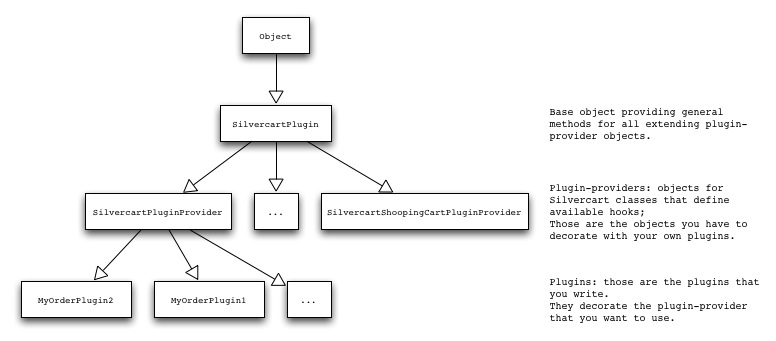

# The plugin system
## Why don't we just use decorators?
- - -
The plugin system has some advantages to just using decorators:

1. All pluggable methods are put together in one file (the plugin provider) that can easily be found via the naming convention, e.g. for “SilvercartOrder” the plugin provider is called “SilvercartOrderPluginProvider”.
2. Otherwise you would have to check the source code of SilvercartOrder and find out, what methods are extendable.
3. We can gather common methods for all plugins in the base class “SilvercartPlugin”.
4. When multiple plugins are decorated into one plugin provider method their output is merged automatically.
5. The gates are open for later developments like priorities when multiple plugins are decorated into one plugin provider method

   
As long as you don't want to write your own plugin providers the mechanism for decorating is exactly the one you know from Silverstripe: use a DataObjectDecorator object, add it as extension and provide the methods you want to decorate. You can find more information on this and on writing your own plugin providers in the following paragraphs.
## The structure of the SilverCart plugin system
- - -
The most basic object for plugins is the class “SilvercartPlugin”. It provides methods that can and should be used by all plugins.

This basic object is extended by specialized objects that are plugin-providers for SilverCart classes. Among those are e.g. “SilvercartPluginOrder”, “SilvercartPluginShoppingCart”, etc. The plugin-provider objects can be decorated with your own specialized plugins. They expose all possible hooks that you can implemented to provide additional functionality and outputs to the original SilverCart classes.

## The connection between SilverCart classes and plugin providers
- - -

## Example for writing  a plugin
- - -
The following example demonstrates the use of plugins by the SilverCart DHL shipping module. Create the plugin file:

	:::php
	class SilvercartShipmentDhlOrderPlugin extends DataObjectDecorator {
		public function pluginOrderDetailInformation(&$arguments) {
			return "OK";
		}
	}

Register the plugin (preferrably in your “_config.php” file):

	:::php
	Object::add_extension('SilvercartOrderPluginProvider', 'SilvercartShipmentDhlOrderPlugin');

## Available plugin providers
- - -
Currently the following plug-in providers are available; on the second level all available plugin methods are listed.

 * SilvercartOrderPluginProvider
 * pluginInit
 * pluginCreateFromShoppingCart
 * pluginOrderDetailInformation

## Creating a custom plugin provider
- - -
### Create a new plugin provider class

	:::php
	class MySilvercartOrderPluginProvider extends SilvercartPlugin {
		public function TestMethod(&$arguments) {
			$result = $this->extend('pluginTestMethod', $arguments);
			
			return $this->returnExtensionResultAsString($result);
		}
	}

### Register the new plugin provider class

	:::php
	SilvercartPlugin::registerPluginProvider('SilvercartOrder', 'MySilvercartOrderPluginProvider');

### Implement the new methods from the provider in your plugin

	:::php
	<?php
	class SilvercartShipmentDhlOrderPlugin extends DataObjectDecorator {
		public function pluginTestMethod(&$arguments) {
			return "It works!";
		}
	}

### Calling the new plugin methods from a template

	:::php
	$SilvercartPlugin(TestMethod)

### Enable plugin functionality in an object

Just add the following line to your “_config.php” file:

	:::php
	<?php
	Object::add_extension('{OBJECT_NAME}', 'SilvercartPluginObjectExtension');

This is needed so that calls from templates to the method “SilvercartPlugin” are possible.

We use this mechanism ourselves for the core objects, e.g. the “SilvercartOrder” object is added in SilverCart's “_config.php”:

	:::php
	Object::add_extension('SilvercartOrder', 'SilvercartPluginObjectExtension');
