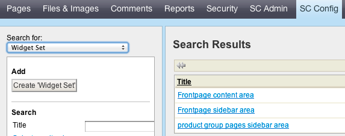
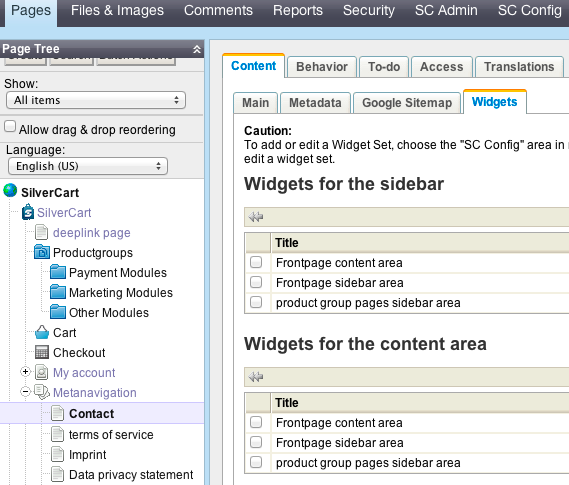
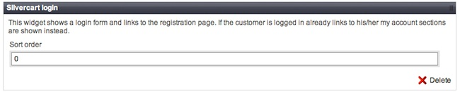
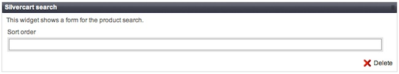
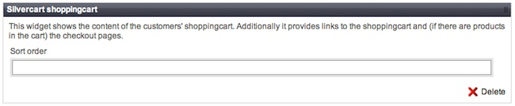

# Widgets

A online store is a lot about presenting products. With widgets you have the freedom to show any product on any place in your site. With the default two column theme widgets can be shown in the sidebar or the content area of a page. Widgets are grouped into widget sets. This might save you from making too many of mouse klicks configuring your site.

As of SilverCart version 1.1 you may use the following widgets:

* Login Form
* Product Group Items
* Product Group Navigation
* Search Form
* Shopping Cart
* Free Text
* Topseller Products

Visit SilverCart Configuration→Widget Set to create a new set of widgets.

Add a title to the widget set to identify the widget set later on. Create as many widget sets as you like.

By pressing that litte spike on the upper right of a widget you can move it into the set. Save the new widget sett by pressing the add button below.

Each widget has an attribute “sort order” demanding an integer as value. This is for sorting the widgets in the set. The smaller the figure the higher the widget will appear.
## Assigning a widget group to a page
- - -

If you created and saved a new widget set you may add this set to any page in the site tree. You may add the widget to the thin right column (sidebar) or the content area on the left side. Assign multiple widget sets to any column if you like to.
## The widgets en detail
- - -

There are 7 useful widgets available yet. Play a little bit with them to get a feeling for your freedom of design.
### name of this widget

This widget is a living bug, please do not use it. We could not get rid of it yet.
### SilverCart login

Displays a login form; no further configuration options;
### Silvercart productgroup items

Choose a product group from the dropdown menu. The menu shows all product groups created in the backoffice.

Define a number of products to show. If you set 5 the top 5 products are selected as shown in you sort order.

The field “use listview” and “Use regular product view…” may be set to 0 or 1. If you switch on the regular product view by setting the field to “1” the products get shown with the template you know from the product categories. This is useful if you want to show this widget in the content area. If you have the regular product view switched on you may toggle between tile view and list view by changing the value of “use listview”.
### Silvercart productgroup navigation

This wiget works only if you have product groups as children of a product group in your site tree. If you choose a prodct group from the dropdown all the sub-groups will be shown in the widget.
### Silvercart search

This widget simply shows a search form. Upon submission the search results page will be called.
### Silvercart shoppingcart

The shopping cart widget shows the cart with all cart positions and the price sum. Further it shows a link to the cart and to the checkout. The widget has no special options.
### Free text

This widget offers you the possibility to enter a text on any place in your site. You may enrich this text with HTML tags, be careful though not to create design bugs using HTML ;)

###Image slider
Shows selected images; A headline and text may be added. The image slider has several configuration options.

### Silvercart topseller products

This last widget shows the most sold products in your store. They are determined by the relation between products and order positions. As option you may define the number of topsellers to show. The sort order is their rank.
