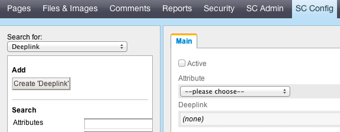

# Deeplinks
         
## What is a deep link?
- - -

Products in Silvercart are organised in product groups. When you watch a product the url in your browser will say something like ”http://www.url_to_your_shop/shop/product_group_1/id_of_the_product/name_of_the_product//”. Imagine somebody wants to link to a product in your shop; this person would need to know in which category the product is located. Especially for price portals they don't have this information available in most cases. To enable them to jump to a product in your shop directly we implemented the deep link mechanism. With a deep link an external referer just needs to know a url and the id of a product. Instead of the long winded URL given above the new URL would look like ”[http://www.url_to_your_shop/shop/deeplink/id/id_of_the_product//]()”. The part ”[http://www.url_to_your_shop/shop/deeplink/id/]()” would never change.
## What can happen when an external referer uses a deep link?
- - -

There are four possibilites:

1. The given identifier matches exactly one product in the database:
 * In this case the shop redirects instantly to the product.
2. The given identifier matches more than one product:
 * In this case a notice is given that there are multiple matches and a list of all matched products is displayed.
3. No product matches:
 * In this case a notice is given.
4. The given identifier is not valid:
 * It could be that the external referer tries to match to a database field that is not enabled or available. In this case an error message should be shown.

## How to set up a deep link
- - -

Imagine an external referer who wants to link to your shop via the manufacturer product number. What would you do to make this possible?

1. Go to the Silvercart storeadmin and enter the Silvercart configuration section. Choose the deeplink mask.
2. Create a new deep link by clicking on “Create deeplink” in the left panel.
3. In the following edit mask you have to choose an attribute from the attribute dropdown field that corresponds to the manufacturer product number. Silvercart stores this product number in the database field “ProductNumberManufacturer”, so choose this field.
4. Check the “Activate” check box.
5. Click “Add”.
6. Now an URL appears that you can give to the external referer
