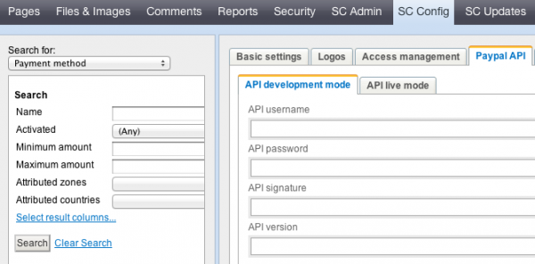

# PayPal

Checking out an online cart with Paypal is very popular in online shops. With our paypal module installed the whole configuration of you PayPal credentials can be done via backoffice. No developer will be needed, no extra configuration fees will be charged.
## Testing PayPal
- - -

PayPal has sandbox to test PayPal payment with Your online shop. You need to register at this sandbox site and create test accounts to use the sandbox. After that You get your personal access credentials which you have to enter via SilverCart's backoffice.

To run PayPal payment on your live site you need to make a contract with PayPal and they will provide you access credentials for the live mode.
