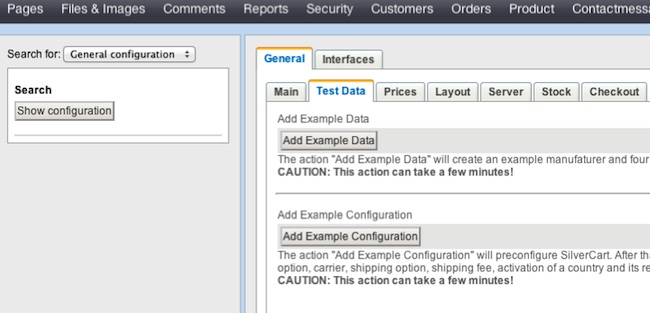

# Getting and setting up SilverCart

Here you can find everything that's necessary to install SilverCart. We describe where you can download everything and how to install it step by step.
## Get it
- - -

### Get SilverCart

First you have to get the SilverCart module itself.

We provide downloads for older versions of our module, but we recommend to always be up to date.

Take me to the download page!
### Get SilverCart project modules
#### Module "SilverCart Prepayment"

This is the most basic payment module for SilverCart. You should always install this one if you just want to test SilverCart or don't know what payment options you're going to offer.

Take me to the download page!
#### Module "SilverCart Paypal"

This is a payment module for the Paypal service. It's not a requirement for SilverCart, but as Paypal is a widespread and well-known payment service, chances are high that your customers will appreciate this payment option.

Take me to the download page!
Get external dependencies
#### Module "DataObjectManager"

Since the default SilverStripe options for managing large datasets are not so comfortable we use the DataObjectManager module from SilverStripe developer Uncle Cheese. It adds nice functionality to object management via the storeadmin and it even looks good :) You have to install the DataObjectManager to use SilverCart.

Take me to the module page!
#### Module "Uploadify"

Uncle Cheese made another great module named Uploadify. SilverCart requires that too.

Take me to the module page!
## Install it
- - -

### Installation workflow

Now that you have all necessary components just follow these instructions to install SilverCart. Please note that during the installation many new pages will be added automatically to your site tree. They are used by SilverCart to provide useful functions to your shop visitors, so do not delete them unless you know exactly what you are doing.
#### Copy and rename the downloaded modules:

Copy the downloaded modules to the SilverStripe installation root (that is the level where the “mysite” directory is located). Note that you should rename all modules (when extracting the downloaded SilverCart archive the name of the folder is something like “silvercart-silvercart-68eba10ebeed”).

The correct names would be: - silvercart - silvercart_payment_prepayment - silvercart_payment_paypal - customhtmlform - dataobject_manager - uploadify
#### Alter the file "/mysite/_config.php":

Set an admin email by adding the line “Email::setAdminEmail('YOUR_EMAIL_ADDRESS');” to the end of the file. Remove the line “SSViewer::set_theme('blackcandy');”
#### Manipulate the file "/mysite/code/Page.php":

You have to alter the class hierarchy in this file. “Page” has to extend “SilverCart\Model\Pages\Page\Page” instead of “SiteTree” and “Page_Controller” has to extend “SilverCart\Model\Pages\Page\Page_Controller” instead of “ContentController”.

So the class declarations should look like this:

	:::php
	//...
	class Page extends \SilverCart\Model\Pages\Page\Page {
		// Your code here...
	}
	class Page_Controller extends \SilverCart\Model\Pages\Page\Page_Controller {
		// Your code here...
	}
	//...

#### Create a directory "silverstripe-cache" on your installation root:

This will prevent odd behavior if you have more than one SilverStripe installation on your host installed
#### Rebuild the database:

run “REPLACE_WITH_URL_TO_YOUR_SITE/dev/build?flush=all”
### Screencast

<iframe width="640" height="360" src="http://www.youtube.com/embed/lDclAfELK98?feature=player_embedded" frameborder="0" allowfullscreen></iframe>

## Next steps
- - -

### What to do after the installation
#### I want to have some testdata to fiddle about

You can make SilverCart generate product groups and products for you, so you can test the behaviour of the shop. This can be done in the backoffice. Visit SilverCart Configuration→General Configuration. There is a tab “Test Data” with two action buttons to install example data(products) and make an example configuration (carrier, shipping method, prepayment, country, shipping fee).

