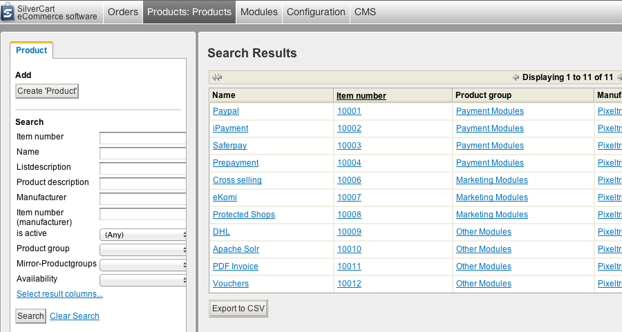
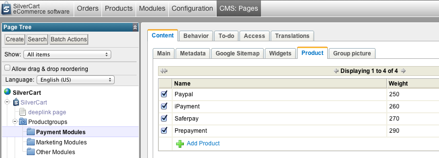

# Product Management

This article refers to SilverCart 1.3.

SilverCart's backoffice has an own area to manage all products added to the store:

You might as well add products directly to a product group in the sitetree:

A product group shows products assigned to this group though it is possible to mirror products from other groups. A product can only be assigned to one specific group. As the product group is part of the URL of a product this is necessary for search engine optimization: A product must have a unique URL otherwise it would be degraded in search engine rank.
## Adding a Single Product
- - -

We hope You do not have to add all Your products by hand. With SilverCart this task can be done with a bulk upload of products. For a small amount of products to add you can use the “Silvercart Administration” section of the backoffice. Add a single product by pressing the “create product” button on the left.

* The item number is the number specific to your shop.
* Manufacturers have their own item number which You may add. In a standard installation this is not shown in the store front.
* From a products name the URL will be built as i mentioned earlier.
* The list description is shown in the overview of a product group. It should be short.
* The product description should be more descriptive and provide the customer with all the information he would expect.

The meta description, meta title and meta keywords are not shown in the storefront. They are just added to the source code of products detail page. Search engines may be interested in the meta data.

* It will not be of much harm if You leave the meta keywords blank.
* The meta description might be shown as a preview text on a search engine result.
* The meta title might be little useful for search engine ranking.

SilverCart may be run as a b2b or b2c solution or both at the same time. In some countries b2b shops show prices net. b2c shops always show prices gross. In order to have pretty price figures the taxes are not merely added to the net price because that would lead to prices like “11.74$”. A price always needs a currency. If You leave the field currency blank the software would behave as if there is no price. The value for currency is “EUR” for € and “USD” for US-$.

   
* Purchase price: The price You bought the product for. This may be valuable information for You calculation but has no effect on the storefront's behavior.   
* MSR price: Some manufacturers recommend sales prices. This is information only for the shop admin. In a standard installation the MSR price is not shown in the storefront.   
* Price gross: The products sales price including taxes. If the shop is set to show prices gross the product will only show in storefront if this price is set.   
* Price net: The products sales price without taxes. If the shop is set to show prices net the product will only show in storefront if this price is set.   
   

If your shop is set to show prices only net you do not have to set a gross price and vice versa. It does not harm but it will never be used for calculations. The taxes are always calculated automatically.

A products weight is important information if it comes to shipping. You can not sell bricks free shipping if You earn 5 Cent/unit. For a short time You would be market's leader in sales but You would run out of money in no time too ;)

   
* The weight is used to calculate an orders total weight and then find the appropriate shipping method and fee.   
   

If you are selling glasses in packages of 5 You might want to let You customers know. Quantity 5 will be shown in the storefront in that case. Anyways You add the weight of the total package not a single glass.

And now for the last product attributes:

   
* A product may be available or not available. This status will be shown in the storefront but has no further effect.
* Sometimes You may want to tell people how long they would have to wait for a product after purchase. Take an custom Apple MacBook as an example: The apple store might tell you that it takes 4-10 days till shipping, because they have to assemble it first. 4 would then be the the “Min. purchase duration”, 10 would be the “Max. purchase duration” and the purchase time unit would be days.   
* A product “free of charge” will show in the storefront even though it has no price set or a price like 0.00€. This is necessary for free products like a brochure or a small gift on a purchase over 50€.   
* “is active” must be checked, otherwise the product is kept out of the storefront.   
* SilverCart cones along with two VAT rates set: 19% and 7% (the two german tax rates). You may delete them or add other tax rates in the “silvercart configuration”.   
* Assign your product a manufacturer. In this dropdown field all the manufacturers will be shown that You added in the backoffice in the “product” area.   
* You may assign an image to You product. For logical reasons the product must be saved one time before this can be done. An image is a database level relation to a product. As long as You have not saved Your new product it does not exist.   
   
