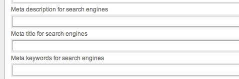

# Search Engine Optimization
 What good is Your shop in the middle of the desert with no customers near? If search engines list your products You are fare more likely to sell them. In fact many shop owners pay a lot of money every month to search engines to be well listed. The process of reaching for the top of search engine results is referred to as “search engine optimization” or SEO.

	

Silvercart's is build to be SEO friendly.

* Each product has a unique URL. If a product could be reached under 2 or more URL's search engines would degrade it in rank because they suspect to be cheated with duplicate content.
* A product's name is always part of the URL.
* Silvercart's sites and products can be prioritized for search engines via backoffice. The cart page is less inportant than the page of a product group.
* Products can be provided with seperate meta keywords, meta descriptions and meta titles.

## The segments of a product's URL
- - -

A products URL consists of a few segments. They all help a product detail page to rank good.

The third segment “productgroups” indicates that this site is a child of a product group. The groups name is “mauls”, the fourth segment. The fifth segment is the products number in the database. The last segment “SpecialHammer” is created from the products name. As a URL must not have special chars or or whitespace this is removed automatically. The last segment is in fact not needed. You would land on the same page if You remove it from the URL. It is just there to please search engines. A keyword in the URL may be very precious.
