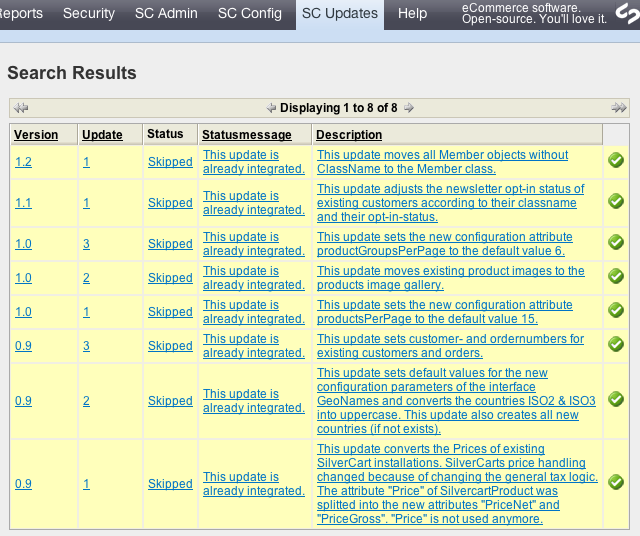

# SilverCart's System Updates

You may have noticed that there is an area “SilverCartUpdates” in Your backoffice.

Please do not touch this. This is for developers only. To help You understand why You should keep Your hands off the update mechanism. I will tell You in short words how it works and what it is exactly:

Every now and than we release a new SilverCart version with bugfixes and/or new features. The update is done easily by deleting all files on the webserver and copying the new version to the webserver. The content of Your site is saved separated from those files in a database. Sometimes updated files require changes in the database to, existing data may be touched, deleted, converted. This is done by our “SilverCart Updates”. If a developer updated Your SilverCart installation on the webserver he must then perform all the necessary updates in the backoffice. Before doing so the developer must make a backup of the database for security reason. If one of those updates does not have the green “check” symbol at the end Your developer has not done his work and You should tell him.
