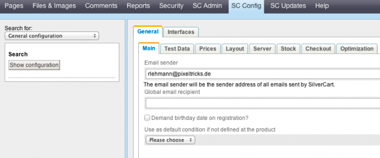

# General Configuration

Your store has a general configuration that can be called in the store admin: SC Config→General Configuration. By default this is loaded automatically when you visit the SC Config area:

Depending on you SilverCart version you may see different tabs. We tried to reorder them by using more tabs after version 1.1 to have a better overview. The options are still the same.
## Email Sender
- - -

If SilverCart sends an email (eg checkout confirmation, contact confirmation) this email address is used as sender.
## Global email receipient
- - -

You may define an email address to which a copy of any mail sent by SilverCart is sent to.
## The Tab Test Data
- - -
A blank installation of SilverCart is no fun ;) You do nat have any products nor are you able to check out because the store is not configured yet (no carrier, no shipping methods, …). By pressing the button “Add Example Data” 4 product categories with 50 products each are created. By pressing the button “Add Example Configuration” a shipping method, a shipping fee and the payment method prepayment will be configured for the country of the installation language.
## Default Currency
- - -

This is the default currency of your store. You may run only one currency by now. Please enter the ISO 4217 code of your currency.
## Minimum Order Value
- - -
Many stores will not let their customers check out until a minimum order value is reached. Activate this feature with the checkbox and define an amount.
## Price Types
- - -

Do you want to show your customers prices gross or net? This is a legal question very important to us germans. Set the price types depending on customer groups: anonymous, regular, business or admin. Without code changes to SilverCart all your registered customers are “regular customers”. If the get set to 'gross' product prices are shown excluding VAT. The VAT still gets calculated on the checkout.

For further information have a look at [Product Management](02-Product-Management).
## Products per Page
- - -

Set the number of products that are shown on a category or search result page. This value may be overwritten if a product group has an own value set.
## Product Groups per Page
- - -

A product group may parent other product groups. Define the number of children before they get paginated.
## Default Product Image
- - -

If a product does not have any image at all this image will be used.
## Apache Solr Search
- - -

Apache Solr is a nice feature to enhance search results. As a customer may not know the correct search term the search returns phonetically similar results. For example if 'Asperin' is given as search term the product 'Aspirin' will be returned as a result too.

Apache Solr must be installed to your webserver. The server admin can then tell you the required url and port parameter. Please enable the checkbox if you have entered the right parameters.
## Stock Management
- - -

We have an own documentation page for [Stock Management](08-Stock-Management). Check it out to find out more.
## Enable SSL
- - - 

You can run your checkout with SSL enabled. This requires changes to your webserver. Contact your admin before you enable this option.
