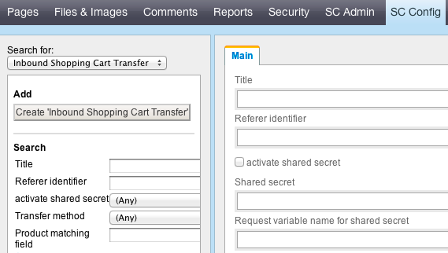

# Inbound shopping cart transfer

## What is an inbound shopping cart transfer good for?
- - -

Imagine you send your product data to an external price comparison portal. Those portals get product data from a number of shops and allow their users to fill a shopping cart with those products. Depending on the products in the cart they show their users the shop with the lowest price for the total amount and provide a link to it, so the users can buy the products there.

The shop system does have to support this operation, otherwise the user has to fill his cart again in the shop and will most likely get a bit angry.
## How does Silvercart support inbound shopping cart transfers?
- - -

You can configure (see next paragraph) a URL for external referers and the format in which the data has to be sent by them. You can create as many configurations as you wish and run them side by side, thus being able to serve prefilled shopping carts for multiple external referers with differing specifications.
## How can I configure an inbound shopping cart transfer?
- - -
The configuration takes place in the storeadmin. Log in there, move to the Silvercart configuration section:

## What about security?
- - -

If you don't want to enable this service for all external referers you can configure a shared secret. If you don't want to enable this service for all external referers you can configure a shared secret.
