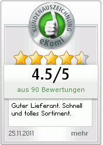
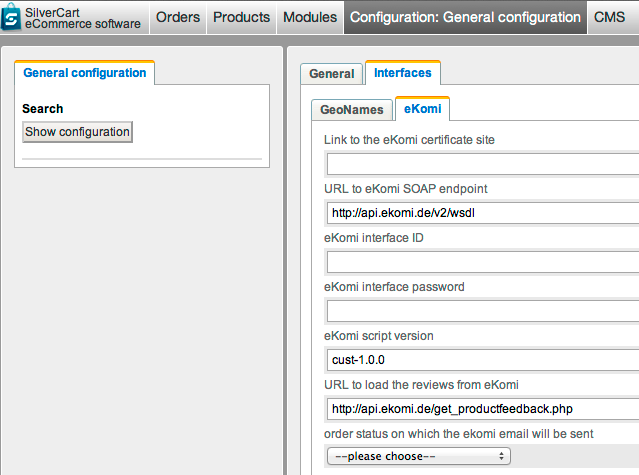

# Ekomi Ratings

Ekomi provides an idependent customer review system. Customer reviews are gathered by sending the customers an email with a direct link to a rating form on the ekomi site. The ratings are displayed in a certificate site. Furthermore, Ekomi offers a widget codes to load an image that contains a rating grade and the latest customer review. Usually a customer rates a whole order but product specific ratings are possible as well.
## How do I configure the module in the back office?
- - -

If the module is installed a new tab appears in the general configuration:

With your Ekomi contract you will get access data which you ought to enter here.

* Link to Ekomi certificate site: Ekomi provides an online certificate for your business. It shows your rating grade and further information about your business.
* URL to Ekomi SOAP endpoint: This field should be filled with a default URL [http://api.ekomi.de/v2/wsdl](http://api.ekomi.de/v2/wsdl). The URL is needed to receive the links to the rating form.
* Ekomi interface ID: Your access ID to Ekomi
* Ekomi interface password: Your access password to Ekomi
* Ekomi script version: This field is filled with a default value (cust-1.0.0)
* URL to load the reviews from Ekomi: If you have offer product ratings to your customers enter the URL from which those ratings are loaded. For performance reasons product ratings should be stored in your shops database.
* order status on which ekomi email will be sent: If a customers order reaches this status the ekomi rating email will be triggered.

