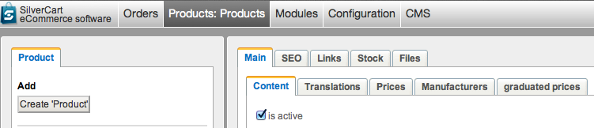
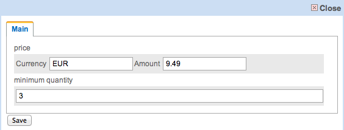
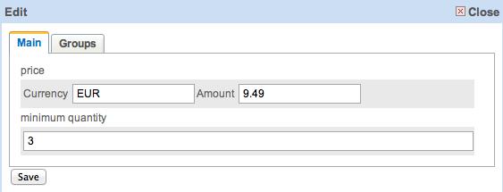

# Graduated Prices

Presumptions:

* Silvercart 1.3
* module silvercart_product_graduatedprice installed
* Silverstripe 2.4.7
* Configuration→General Configuration→General→Layout→Display type of product administration is set to tabbed

## What kind of module is this?
- - -

This module lets you define prices depending on the quantity a customers buys. These prices may be valid to restricted customer groups or valid to all customer groups.
## How do I configure a graduated price for a product?
- - -

Open the details of a product. I have the test data installed and I am using the product “paypal”. A tab “graduated price” is shown.

Open that tab and add a new graduated price. A popup will open:

The product “paypal” has a gross price of €9.99. I created a graduated price of €9.49 and a quantity of three. I pressed the save button and closed the popup. Now this newly added graduated price is valid for all customer groups as there are no restrictions. If you want to restrict it, open that graduated price by pressing the edit button. You will see the following popup:

Go to that tab and restrict that graduated price to one or many customer groups. Again, if no group is checked the graduated price is valid to all groups.
## How do the added graduated prices effect the customers view?
- - -

I put this product “paypal” in my cart in a quantity of one and this is what my cart looks like:

As an anonymous (not logged in) customer I get the gross prices shown and the gross price for this product was set to €9.99. Now look what happens if I increase the products quantity to three:

The products price single goes down to the €9.49 we configured earlier.
## Can a product have many graduated prices?
- - -

Yes. Add as many graduated prices as you like.
## How is the right price for a customer found?
- - -

The graduated prices module always selects the most convenient price for the customers group. An example: You are selling light bulbs. One bulb costs 1$, at a quantity of 5 a bulb costs 90 Cents. Then you made a mistake and added a graduated price of 95 Cent at a quantity of 10. The price for a single bulb would go up if a customer increases the quantity. A customer would be pissed or even worse abandon the cart. Thats why the module would show the price of 90 Cent in this case.
