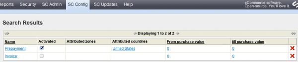
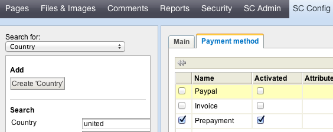
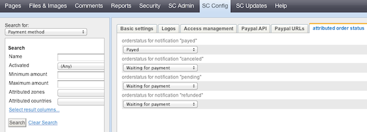

# Payment Modules

We offer several payment modules for SilverCart. As soon as You developer installed them they will be visible and configurable in the store admin:

If you made a contract with a payment provider you will get access credentials (API credentials) to their gateway. For test reasons mostly development and live credentials are provided. Just edit those credentials in the sore admin and your online store is ready to earn you some money.

## Activating a payment method for the checkout process
- - -

Of course You can activate and deactivate a specific payment method by using the “activated” checkbox. You also have to connect a new payment method to a country. Some payment methods may not be valid internationally. Go to SilverCart Configuration→Country and select a country. Assign payment methods via the table of the tab “Payment method”.

## Configuring order stati
- - -

The most simple order stati are payed and unpayed. To manage your orders You would want to know them to decide weather to ship an order or not. If a customers pays with PayPal the order status must be set to “payed” on a successful transaction. However many payment providers have different payment ways eg an order's status might be pending and the payment confirmation takes a few minutes. Thats why you have to configure different order stati for every payment method.

## Restricting payment methods to minimum and maximum order amounts
- - -

A payment methods costs you money. If You earn 50 Cent on a small order you might not want to offer a payment method that costs you more. Especially credit card payments can cost a lot more than that. For that reason You can restrict a payment method to a minimum order amount.

On the other hand a payment could be cancelled under specific circumstances depending on the payment providers regulations. If this happens with a 10$ order you might not care but a 10 000$ order that is shipped and remains unpaid might kill your business. Thats why you can restrict payment methods to maximum amounts.

